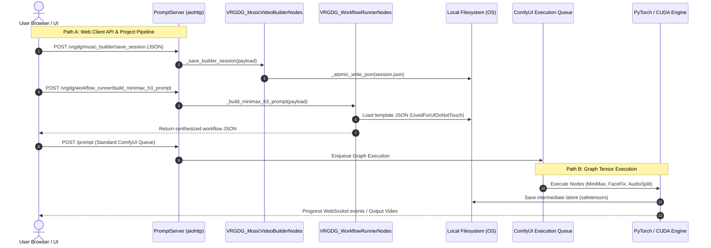
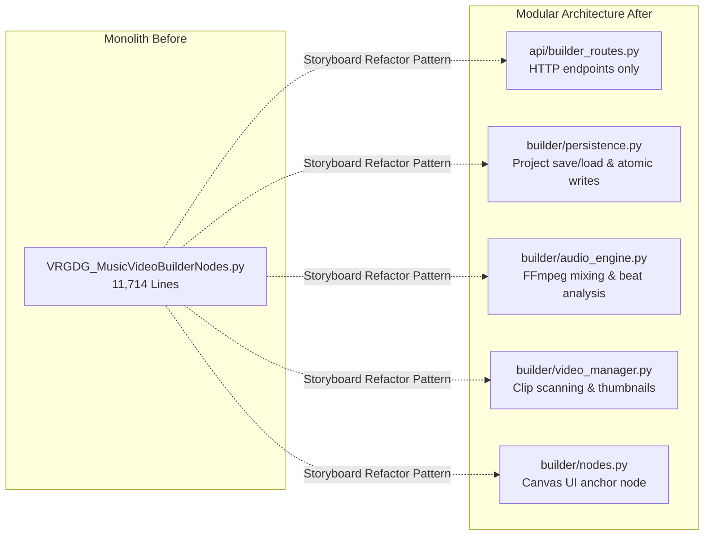

# Comprehensive Architectural Review and Code Audit: `comfyui-vrgamedevgirl`

**Audit Target:** `comfyui-vrgamedevgirl` (ComfyUI Custom Node Pack)  
**Evaluator:** Senior Software Architect & Systems Auditor  
**Date of Audit:** September 2026  
**Repository Version:** v9.1.1 (Updated: 2026-08-06 / Storyboard Refactor: 2026-09-26)  
**Standard Benchmarks:** Python Standard Library (3.10–3.12+), PEP 8, PEP 585/604, SOLID Principles, Clean Architecture, OWASP Secure Coding Practices.

---

## Progress & Current Status (updated 2026-09-28)

Work happens on branch `refactor/split-music-video-builder-ui`. **Nothing is committed yet.** Everything below is uncommitted work in the tree.

Last full verification: the main suites pass, 277 Python tests (1 skipped) and 190 Node tests. With all 8 optional packs installed, ComfyUI registered every node, with no duplicate or failed imports and no VRGDG page errors, and the builder smoke test was clean.

### Done

- **Storyboard builder split** into focused modules.
- **F1:** the big startup scripts are lazy-loaded. `web/VRGDG_MusicVideoBuilderUI.js` is now a 72-line stub, and the builder code lives in `web/music_video_builder/*.mjs`.
- **F2:** dead scripts deleted.
- **HuMo removal:** all HuMo files and workflows were deleted. The nodes LTX needed were kept and moved into the LTX files.
- **Part 2 critiques fixed:** 1.2, 1.5, 1.6, 2.3, 2.4, 2.5, 3.1, 3.2, 4.2, 4.3, and the NameError bug. The Findings Index below has the per-item status.
- **Scene renumbering:** merging or deleting scenes now renames rendered per-scene files, latents included, to match their new scene numbers (`_SCENE_ASSET_FOLDERS` and the renumber route in `VRGDG_MusicVideoBuilderNodes.py`, `rewriteRenamedScenePaths` in `segments.mjs`).
- **A2:** `VRGDG_FlowBrowserNodes.py` and `VRGDG_BrowserImageRoutes.py` were merged into `VRGDG_BrowserImage.py`. The routes file's duplicate `_coerce_int`/`_coerce_bool` helpers and an unused `folder_paths` import were dropped. Verified in ComfyUI: 56 nodes, 0 failed, the browser image routes respond, and the builder smoke test is clean.
- **Structured JSON output pilot:** kept as a schema-constrained retry for the storyboard dialogue planner, plus a context-window guard.
  - **Runner support:** `_run_builder_text_llm(..., json_schema=...)` constrains replies for four runners:
    - built-in and Qwen GGUF: `llama.cpp` `response_format`, enforced during generation;
    - LM Studio: its OpenAI-compatible `/v1/chat/completions`, because the native `/api/v1/chat` rejects every schema key;
    - own server.

    Schema calls skip the prose cleaners.
  - **Dialogue planner:** the first call stays plain text. On a parse failure it re-runs the plan under `_storyboard_dialogue_plan_schema()`, which lives in `llm/prompts/storyboard.py`. Runners without schema support keep the text repair prompt.
  - **Context guard:** prompt plus output always fits the user's context window. LM Studio uses a conservative estimate against `lmstudio_context_limit`. The built-in GGUF counts the prompt with the model tokenizer against `n_ctx`. A prompt that alone does not fit gives a "Raise the context limit in LLM Runner" error.
  - **Measured, 4-scene plans:**
    - LM Studio `gemma-4-e4b-it` with realistic limits: 10/10 on the first reply, with or without the schema, so the retry is never paid.
    - SuperGemma 26B Q4_K_M on the built-in GGUF: the text path produced 1/3 plans, and 2 failed even after repair. The schema retry produced 3/3.
  - **Costs:**
    - Schema decoding on the built-in GGUF is slow: about 130s for a nested plan, against about 10–20s for text. That is why the schema is only used on retry.
    - On LM Studio a schema call cannot send the per-request context size.
  - **Location scout:** unchanged. Its line format already parsed first time on every model tested, so the schema added only latency.
  - **Tests:** context-guard, schema-runner and schema-matches-prompt tests were added. `test_builder_lm_studio_seed_retry` now loads the guard helpers. 286 Python tests pass.
- **Lint cleanup:** 18 dead statements were removed.
  - 11 unused lazy `VRGDG_SuperGemmaGGUFChat` imports in `llm/builder_runner.py`, `llm/image_prompt_generation.py` and `llm/video_prompt_generation.py`. `llm/gguf.py` is loaded at startup, so these triggered nothing.
  - 7 unused local assignments with side-effect-free right-hand sides: `seed`, `builder_instruction_key`, `style_theme`, `subject_context`, `image_name`, `sampler_advanced_id` and `tail_samples`.
  - Lint is clean on those files. The runner probe gave byte-identical results, and the smoke tests are clean.
- **L4:** `VRGDG_SilentAudioRoutes.py` was folded in and deleted.
  - Its silence helpers moved to `builder/audio.py`, and the `/vrgdg/music_builder/create_silent_audio` route moved to `builder/routes.py`.
  - The dead try/except fallback around `_read_audio_peaks` was dropped; that function is now in the same module.
  - Verified live: project-scope silence (1,600 peaks) and scene-scope silence (600 peaks) are both written, a zero duration gets the same 400 error, and the smoke tests are clean.
- **Hardcoded machine paths removed.** Nothing references a fixed location any more.
  - **Dev scripts:** `scripts/build_minimax_h3_ref2va_2pass_audio_api.py` and `scripts/build_ltx25_normal_sampler_workflow.py` take their files as command-line arguments. They used `Z:` paths before. `scripts/Backport-Krea2ToMusubi.ps1` requires `-TargetRoot` and `-SourceRoot` instead of defaulting to `A:\MUSUBI`.
  - **SheetSage2 node (YuE2 pack):** defaults to the `m-a-p/SheetSage2` and `m-a-p/MERT-v2-FullSong` model IDs, with empty Python and cache fields. They used `E:\Yue2\…` before. The YuE2 README now describes paths relative to `target_root`.
  - **LoRA training pack:** 36 `A:/MUSUBI/…` node defaults and Krea2 Studio seed settings are now empty. An empty root gives the existing "musubi_root does not exist" error.
  - **Font lookup:** the LoRA grid font lookup uses `%WINDIR%\Fonts` instead of `C:\Windows\Fonts`.
  - **Workflows:** 128 machine-specific path values were cleared in 51 workflow and template JSON files. They included `Z:\…`, `A:\…` and `E:\…` locations, and `C:\Users\pyro1\…` from another account. Only the exact string values changed, and each file was re-parsed to confirm that.
    - In the builder templates, every cleared field is either overwritten by the runner at render time or display-only. The one display-only case is FLF node 755, a ShowText whose saved text used to reach every FLF render.
    - The runner probe built graphs identical to those from before the change.
  - **Still unreferenced:** three templates the runner never loads, `LTX2.3_CameraMotionInput_API.json`, `minimax_audio_driven_builder_normal_2pass_api.json` and `VRGDG_TextToVideo_CustomAudio_API.json`. They are candidates for deletion.
- **Dev script fix:** `scripts/build_minimax_h3_ref2va_2pass_audio_api.py` no longer puts the pack folder on `sys.path`. The stand-in package already reaches the pack, so `import nodes` now finds ComfyUI's `nodes.py` instead of the pack's.
- **A5b (split `VRGDG_WorkflowRunnerNodes.py`):** the 6,832-line file is now a 269-line node file (its three nodes) plus 11 modules in `runner/`.
  - The package is named `runner/` because `workflows/` would collide with the `Workflows/` template folder on Windows.
  - Modules and line counts:
    - `paths.py` (161)
    - `models.py` (158)
    - `api_graph.py` (694)
    - `image_workflows.py` (705)
    - `ltx_workflows.py` (1,166)
    - `minimax_inputs.py` (368)
    - `minimax_patches.py` (748)
    - `minimax_workflows.py` (976)
    - `utility_workflows.py` (118)
    - `video_files.py` (1,148)
    - `routes.py` (447)
  - All 206 definitions were checked unchanged, apart from re-pointed relative imports. The 27 pack-folder `__file__` paths each got one more `dirname`, and every one was counted.
  - Three importers, 8 tests and the MiniMax dev script were updated.
    - Tests read the runner through `read_runner_source()` in `tests/builder_source.py`.
    - Two tests that cut a function out by searching to the next `def` now use `python_function_source()`, which picks functions by name.
  - Verified:
    - The full suite passes, and the builder and storyboard smoke tests are clean.
    - A 36-step route probe gave identical results before and after the split. It covered 15 graph builds (image, LTX, MiniMax, utility and the GPT Image bridge) plus choices, audio clip prep and the video-file routes.
    - The only differences were per-project output folder hashes, because the two probe folders had different paths.
- **Gemma 4 out of `VRGDG_GeneralNodes2.py`:** four functions moved unchanged to `llm/gemma4.py`: `_clean_gemma4_text`, `_prompt_creator_custom_instruction`, `_build_gemma4_prompt` and `_run_gemma4_prompt`.
  - The `/vrgdg/gemma4/generate` route moved into `builder/routes.py` with the same responses.
  - The misnamed `_VRGDG_TEST_SAVE_ROUTE_REGISTERED` flag and the duplicate registration calls are gone, along with 13 imports that became unused.
  - `VRGDG_GeneralNodes2.py` is now nodes only: 2,220 lines down to about 1,900.
- **A5a (split `VRGDG_MusicVideoBuilderNodes.py`, Critique 1.1):** the 11,682-line file is now a 38-line node file plus 12 modules.
  - **`builder/`:**
    - `paths.py` (369 lines)
    - `audio.py` (910)
    - `media.py` (714)
    - `project_copy.py` (700)
    - `project.py` (1,601)
    - `routes.py` (851)
  - **`llm/`:**
    - `output_checks.py` (845)
    - `builder_instructions.py` (317)
    - `builder_runner.py` (1,079)
    - `video_prompt_generation.py` (1,671)
    - `image_prompt_generation.py` (1,889)
    - `builder_agent.py` (543)
  - Three instruction-text builders moved into `llm/prompts/video.py` and `llm/prompts/image.py`.
  - Modules are ranked so imports only go one way, with no cycles.
  - All 317 definitions were checked unchanged, apart from re-pointed relative imports and one `__file__` path fix in `_default_audio_srt_paths`.
  - The 7 importing modules and 15 tests were updated. Tests read the whole backend through `read_builder_backend_source()` in `tests/builder_source.py`.
  - Verified:
    - The full suite passes, and the builder and storyboard smoke tests are clean.
    - A 31-step route probe gave identical results before and after the split, apart from save timestamps. It covered: new project, audio save and analysis, SRT, session save and load, scene audio, renumber after insert and removal, video scan, instruction overrides and presets, save-as branch, and text files.
- **P2 (split `LLM.py` by engine type):** `LLM.py` (3,736 lines) became five files.
  - `llm/cache.py` (77 lines): the caches, the GGUF lock and cache clearing.
  - `llm/google.py` (221): the Gemini helpers and Nano Banana Pro.
  - `llm/api.py` (638): LLM Multi.
  - `llm/huggingface.py` (1,212): the Qwen 3.5 and 2.5 base classes.
  - `llm/gguf.py` (1,652): the GGUF base, Qwen GGUF, SuperGemma and Unload.
  - All 20 definitions were checked unchanged, node names are the same, and `__init__.py` loads `.llm.api`, `.llm.google` and `.llm.gguf`. The memory-cleanup route now finds the caches in `llm/cache.py`.
- **P1 (one prompt file per area):** `llm/prompts.py` became `llm/prompts/` with `minimax.py`, `storyboard.py`, `image.py`, `video.py`, `lyrics.py`, `concepts.py` and `gemma4.py`.
  - The inline prompts from the builder, the prompt creator and `VRGDG_GeneralNodes2.py` moved in too. That is 64 definitions, each moved once and unchanged.
  - The dead `_WHISPER_REPAIR_INSTRUCTIONS` prompt was removed; it was never used.
  - The builder's instruction defaults, labels and preset groups stay in the builder, since they are UI wiring.
- **A4 (`llm/` phase 1):** created `llm/` with two modules.
  - `llm/prompts.py` holds `VRGDG_MiniMaxH3PromptInstructions.py`, the builder's three image and I2V prompts from `VRGDG_VideoEditorNodes.py`, and `VRGDG_StoryboardLLMs.py`.
  - `llm/text_cleaning.py` holds `VRGDG_GemmaPromptSanitizer.py` and the two Gemma cleaners from `VRGDG_VideoEditorNodes.py`.
  - The builder and prompt creator no longer import cleaners from the video editor module. `VRGDG_VideoEditorNodes.py` is down to its image and video routes (69 lines).
  - Verified in ComfyUI: 56 nodes, 0 failed, the builder instruction route serves the moved prompts, and the builder and storyboard smoke tests are clean.
- **A3 (MiniMax H3):**
  - **M1:** merged `FastVAEDecode`, `AudioDrive`, `ReferenceMedia` and `ImageReference` into `VRGDG_MiniMaxH3Nodes.py` (4 nodes, names unchanged).
  - **M2:** folded `VRGDG_MiniMaxH3Timing.py` into `VRGDG_MiniMaxH3LatentManager.py`. The workflow runner imports `calculate_minimax_h3_timing` from there now.
  - **M3:** removed the absolute-import fallback in `VRGDG_MiniMaxH3LatentContinuationNodes.py`, plus three unused names it hid. This closes Critique 1.2.
  - Not moved: the latent manager, continuation nodes and upscaler stay as they are. `VRGDG_MiniMaxH3PromptInstructions.py` moves in A4.
  - Verified in ComfyUI: 56 nodes, 0 failed, and the builder smoke test is clean.
- **L1:** deleted `lib/`. Nothing imported it.
- **L2:** folded the used helpers of `VRGDG_PostProcessPreviewHelpers.py` into `VRGDG_LUTVideoTools.py` and dropped the unused `preview_output_path`.
- **L3:** merged `VRGDG_ResourceMonitor.py`, `VRGDG_UpdateRoutes.py` and `VRGDG_CustomNodeRoutes.py` into `VRGDG_SystemRoutes.py`.
  - The update and custom-node routes now register at import, like the resource monitor's. That dropped the `_register_routes` wrappers and their guards.
  - The two files share one `_NODE_DIR`.
  - Verified in ComfyUI: 56 nodes, 0 failed, all six system routes respond, and the LUT video preview works.
- **Scene split/insert renumbering:** splitting a scene with the scissors, or adding a scene before or after one mid-timeline, now shifts later scenes' files and latents up one number (`_shift_scene_assets`, `/vrgdg/music_builder/renumber_scenes_after_insert`, `SceneLatentManager.make_room_for_scene`). Merge and delete share the same shifting code.
- **Optional node packs:** every node the Music Video Builder does not use moved to `optional_nodes/<pack>/`.
  - There are 8 standalone packs: `face_fix`, `general_utilities`, `llm_nodes`, `long_video`, `lora_training`, `ltx_minimax_tools`, `music_audio` and `ui_tools`.
  - Each pack has its own `__init__.py`, `requirements.txt`, `web/`, tests and workflows. Node names are unchanged.
  - The main pack now registers only the 56 builder nodes.
  - `optional_nodes/README.md` covers install steps and which workflows need which packs.
- **Browser image nodes restored to main.** The builder's Flow, GPT Image and Meta AI image generation queues graphs that use these nodes, so they must be in the main pack. `ui_tools` keeps a helpers-only copy.
- **LTX check:** no builder template in `Workflows/UsedForUIDoNotTouch/` uses a node that moved to a pack.
- **A1:** `GeneralVideoNodes2.py` was merged into `GeneralVideoNodes.py` and deleted. The moved definitions were checked against the originals and the tests pass.
- **Relabel after delete:** deleting a base scene now renumbers the generic labels after it ("Scene N", "N. description", empty). Custom names are unchanged. Delete, merge and the Builder Agent share `renumberGenericBaseSceneLabels` in `segments.mjs`, which replaces the two local copies. Verified: 286 Python tests OK, 191 Node tests pass, and the live smoke and storyboard probes are clean.
- **Root cleanup (feature folders):** the pack root now holds only `__init__.py`, `pyproject.toml`, `requirements.txt`, `README.md`, `LICENSE`, `update_notes.json` and `report.md`. The 27 root modules moved with `git mv` (two untracked ones with a plain move) and lost their `VRGDG_` prefix:
  - `core/`: `any_type`, `atomic_write`, `model_paths`, `system_routes`.
  - `storyboard/`: `nodes`, `dialogue_scenes`, `persistence`, `scene_helpers`, `scene_prompts`, `story_layer`.
  - `minimax/`: `nodes`, `latent_manager`, `latent_continuation`, `latent_upscaler`.
  - `post_process/`: `lut_video_tools`, `luts` (was IV_Adjustments), `face_fix`.
  - `general/`: `lyrics` (was nodes.py), `video` (GeneralVideoNodes), `utility` (GeneralNodes2), `audio`, `ltx_msr_reference`.
  - `builder/nodes.py`, `builder/video_editor.py`, `runner/nodes.py`, `prompt_creator/nodes.py`, `browser/nodes.py`.
  - A script resolved and rewrote all 78 affected relative imports (including ones inside functions). All 176 relative imports in the pack resolve and every imported name exists. The 11 `__file__` paths that reach pack-root folders gained one level. `__init__.py` lists the new modules and lost the dead `FileDeleteNode` optional-module code.
  - Fixed on the way: `prompt_creator` still imported the deleted `LLM.py` inside two functions, so its built-in Gemma path crashed. It now imports `llm.gguf` and `llm.cache`.
  - Verified: 1,778 top-level statements compared with the pre-move snapshot, and only the path fixes, the LLM fix and `__init__.py` changed. 56 nodes, 0 failed. `/object_info` identical for all 56 nodes. Builder and runner route probes identical apart from save timestamps. 294 Python tests OK, 191 Node tests pass, smoke probes clean.
  - `core/any_type.py` and `core/atomic_write.py` are still untracked in git; add them in the commit.
- **Critique 3.6 (video post-process renders):** LUT, Film Grain and Adjust video renders now take one ffmpeg pass, with no intermediate OpenCV encode and no codec retry loop.
  - LUT uses ffmpeg `lut3d` (with `blend` for strength below 10), fed a `.cube` rewritten from the preview parser's data so render and preview grade identically.
  - Film Grain and Adjust pipe frames through the existing GPU math straight into the x264 encoder. Frames go up to the GPU as uint8 instead of float32.
  - ffmpeg is found through the pack's `_find_ffmpeg_path` (PATH or `imageio_ffmpeg`). The old code only checked PATH, which on this machine meant audio was silently dropped and ~120 MB near-lossless files were written for a 20 s clip.
  - 20 s 1080p clip, old vs new: LUT 23.3 s to 3.1 s, Adjust 16.5 s to 7.0 s, Grain 16.9 s to 6.5 s. Audio kept, files ~14x smaller, same quality (PSNR against the exact effect within encode noise).
- **Critique 1.3:** `/open_local_file` now opens only video, image, audio and text files, or folders (the Open Project button needed folders and was broken). Programs and scripts are refused.
- **Critique 1.4:** mostly out of date. There is no `git reset --hard`, the self-update only fast-forwards `origin/main`, and the installer accepts only allowlisted ids with fixed URLs. One optional hardening remains (see open items).
- **Custom-node installer (critique 1.4 follow-up):** the Video Builder custom-node installer now runs ComfyUI-Manager's `cm_cli` in ComfyUI's Python instead of `git clone` and `pip`. No new requirement: `cm_cli` comes from `comfyui_manager`, which ComfyUI's `--enable-manager` installs. comfy-cli was not added; it only wraps `cm_cli` and adds about 20 packages, including analytics libraries.
  - Five packs install by Comfy Registry id (VideoHelperSuite, KJNodes, GGUF, LTXVideo, MMH3-UltimateUpscale). TE-Speed, audio-T8 and the latent upscaler are in neither the registry nor Manager's list, so they install from their GitHub URLs.
  - Reinstall Requirements runs `cm_cli post-install` on the existing folder.
  - The custom nodes card shows each pack's source and disables installs with a notice when ComfyUI-Manager is missing.
- **`.mjs` caching (ComfyUI core):** `middleware/cache_middleware.py` now sends `no-store` for `.mjs` like `.js`, with a test case. This is a local core edit and is lost on a ComfyUI update until it lands upstream.
- **Structured output rollout:** the schema retry now also covers the FLF scene-beat JSON repair and the Story Arc format retry. Both first calls stay plain text.
  - FLF: re-runs the beat under `_storyboard_flf_endpoint_schema()` (the five FLF keys).
  - Story Arc: re-runs under `_storyboard_story_arc_schema(labels)`, one JSON key per required heading, then rebuilds the heading text for `_normalize_story_arc_output`.
  - Measured with the first reply forced malformed: LM Studio `gemma-4-e4b-it` 5/5 for both, schema and text retry alike (~2s). SuperGemma 26B GGUF: Story Arc schema 3/3 (~32s) vs text 2/3; FLF schema 3/3 full beats (340-425 chars) vs text repair returning a 21-char fragment of the broken reply.
  - Not wired: the hosted-API runner (each provider has a different schema API, none testable here). The own-server schema path is still untested.

### Next up (in order)

- Nothing queued. Pick from the open items below.

### Other open items

- **Custom-node installer:** a fresh install through `cm_cli` has not been tested yet, because all eight packs are already installed here.
- **Tooling:** pyflakes is not installed in `python_embeded`. Use the system `python -m pyflakes`.
- **Commits:** split the uncommitted work into coherent commits, for example: pack split, HuMo removal, critique fixes, scene renumbering, A1/A2 merges.

### Known consequences of the optional-pack split

- **Workflows that need packs installed:**
  - LTX 2.3 V5.x workflows (main `Workflows/`): `general_utilities`, `ui_tools` and `llm_nodes`.
  - MiniMax upscaler workflows: `long_video` and `general_utilities`.
  - Z-Image Upscale AnyImage and Wan 2.2 workflows: `general_utilities`.
  - LoRA Dataset Creator workflows: `general_utilities` plus the main pack.
  - YuE2 Cover/Starter workflows: the main pack.
  - Older workflows show moved nodes as missing until the matching pack is installed.
- **Copied code:** packs carry their own trimmed copies of shared code (`LLM.py`, `llm_helpers.py`, `VRGDG_AnyType.py`, `VRGDG_AtomicWrite.py`). Fixes in main do not reach them.
- **Renamed routes:** pack routes that clashed with main were renamed: `/vrgdg/video_editor/editor_image` and `/vrgdg/prompt_creator/gemma4/*`.
- **Merge groups inside packs:** Part 3 groups G5 (enhancers), G6 (compare), G7 (meta batch) and G9 (LongShot) now live in packs. Do them when the packs become their own repos. Critique 3.5 (face detector caching) moved to `face_fix` as well.

### Part 3 status

- **Section 1 (`llm/`):** phase 1 done (A4). Phases 2 and 3 are open.
- **Section 2 merge groups:**
  - Done or no longer needed: G1 (HuMo removed), G2 (A1), G3 (`VRGDG_GeneralNodes.py` moved to `general_utilities`), G4 (the face-fix routes stay in main for the builder, and the nodes are in the `face_fix` pack).
  - G8 (the smaller version, A3) and G10 (A2) are done.
- **Section 3 (move every root file into subpackages):** not planned. It would be a large file move that fixes nothing, AGENTS.md asks to preserve the file layout, and many tests open source files by root path. The targeted merges above reduce the file count instead.
- **Section 4 (split the big files):** see A5. `LTXLoraTrain.py` is now in the `lora_training` pack and out of scope for main.
- **Frontend items:** done. There are no PNGs left in `web/`, the big scripts are lazy-loaded, and the builder JavaScript is split into modules.

---

## Executive Summary & Audit Metrics

An exhaustive, AST-driven and runtime-verified architectural audit was conducted across the entire `comfyui-vrgamedevgirl` repository. The codebase represents a hybrid system combining standard ComfyUI graph-execution custom nodes with a massive, stateful web application backend running embedded within ComfyUI's internal `aiohttp` server (`PromptServer`).

### Repository Scale & Metrics Table

| Metric | Measured Value | Architectural Assessment |
| :--- | :--- | :--- |
| **Total Python Source Files** | 72 files | Highly fragmented surface area with redundant variants |
| **Total Python Lines of Code (LOC)** | 81,544 lines | Massive code footprint for a node extension |
| **Files > 1,000 Lines** | 18 files | Severe code concentration in procedural monolithic files |
| **Files > 5,000 Lines** | 3 files | Critical God-modules (`VRGDG_MusicVideoBuilderNodes.py`: 11,714 LOC; `LTXLoraTrain.py`: 8,596 LOC; `VRGDG_WorkflowRunnerNodes.py`: 6,832 LOC) |
| **Successful Modularization Proof-of-Concept** | `VRGDG_StoryboardBuilderNodes.py` | Successfully decoupled from a 3,535-line monolith down to 175 lines by extracting 6 focused modules (`DialogueScenes`, `Persistence`, `SceneHelpers`, `ScenePrompts`, `StoryLayer`, `LLMs`). This serves as the blueprint for the entire repository. |
| **Total Defined Classes** | 276 classes | High proportion of thin wrapper/placeholder classes and cloned variants |
| **Total Defined Functions** | 2,658 functions | Overwhelmingly procedural top-level routines |
| **Registered ComfyUI Nodes** | 249 nodes | Extensive duplicate node variants (V2, V3, V5, SRT, Manual, etc.) |
| **Registered HTTP Web Endpoints** | 74 distinct routes | High-risk embedded web backend with unauthenticated disk/process control |
| **Unit Test Suite Pass Rate** | 235 / 258 passing (91.1%) | **23 Test Failures & Errors** (17 failures, 6 errors) driven by brittle AST scraping, JS regex testing, and type errors |
| **Silent Exception Passes (`except Exception: pass`)** | 118 occurrences | Systematic failure masking across LLM, audio, and video pipelines |
| **Bare `except:` Handlers** | 1 occurrence | Intercepts `KeyboardInterrupt` and `SystemExit` (`HumoAutomation.py:2363`) |
| **Subprocess / External Shell Calls** | 82 invocations | Inefficient process spawning, blocking event loops, unvalidated file launching |
| **Shared Global Mutable Variables** | 27 global references | Widespread race conditions, non-thread-safe model caches, and mutable progress state |

---

# Part 1: Structural & Architectural Breakdown ("As-Is")

## 1. System & Module Architecture

The system functions across three fundamentally divergent paradigms:
1. **ComfyUI Graph Execution Model:** Dataflow pipeline where nodes process PyTorch tensors (`IMAGE`, `AUDIO`, `LATENT`) deterministically within ComfyUI's execution queue.
2. **Stateful Web Application Backend:** A set of 74+ REST-like endpoints registered directly onto `PromptServer.instance.routes` (`aiohttp.web`), managing JSON project sessions, filesystem assets, local model discovery, and client communications.
3. **External Process Supervisor:** A coordination layer spawning external subprocesses (`ffmpeg`, `git`, `powershell`, `nvidia-smi`, `pip`, and headless Google Chrome instances via Chrome DevTools Protocol) to bypass standard Python/ComfyUI constraints.

### 1.1 Complete Functional Module Categorization

The 72 Python modules partition into 8 core architectural subsystems:

```mermaid
graph TD
    subgraph Core & Server Infrastructure
        INIT[__init__.py] --> ROUTER[PromptServer Routes]
        INIT --> SUBMODS[Submodule Importer / Custom Loader]
        MPS[VRGDG_ModelPathSettings.py]
        UP[VRGDG_UpdateRoutes.py]
        CNR[VRGDG_CustomNodeRoutes.py]
        RM[VRGDG_ResourceMonitor.py]
    end

    subgraph Studio Monoliths & Builders
        MVB[VRGDG_MusicVideoBuilderNodes.py<br/>11,714 lines]
        WFR[VRGDG_WorkflowRunnerNodes.py<br/>6,832 lines]
        MVPC[VRGDG_MusicVideoPromptCreatorNodes.py<br/>2,079 lines]
        VBE[VRGDG_VideoEditorNodes.py<br/>1,466 lines]
    end

    subgraph Storyboard Subsystem (Refactored Blueprint)
        SBN[VRGDG_StoryboardBuilderNodes.py<br/>175 lines - Orchestrator]
        SBL[VRGDG_StoryboardStoryLayer.py<br/>991 lines]
        SBD[VRGDG_StoryboardDialogueScenes.py<br/>432 lines]
        SBP[VRGDG_StoryboardScenePrompts.py<br/>578 lines]
        SBLLM[VRGDG_StoryboardLLMs.py<br/>855 lines - Centralized Prompts]
        SBPER[VRGDG_StoryboardPersistence.py<br/>520 lines]
        SBHELP[VRGDG_StoryboardSceneHelpers.py<br/>391 lines]
    end

    subgraph LLM & Inference Engine
        LLM[LLM.py<br/>4,564 lines]
        GPS[VRGDG_GemmaPromptSanitizer.py]
        LSD[VRGDG_LongShot* Suite]
    end

    subgraph MiniMax H3 Latent Suite
        MMH3_LM[VRGDG_MiniMaxH3LatentManager.py]
        MMH3_CC[VRGDG_MiniMaxH3ConnectedChunks.py]
        MMH3_LC[VRGDG_MiniMaxH3LatentContinuationNodes.py]
        MMH3_LU[VRGDG_MiniMaxH3LatentUpscaler.py]
        MMH3_VAE[VRGDG_MiniMaxH3FastVAEDecode.py]
    end

    subgraph Video, Audio & Image Enhancement
        NODES[nodes.py]
        GVN[GeneralVideoNodes.py / 2.py]
        HUMO[HumoAutomation.py / Extra1 / Extra2]
        FF[VRGDG_FaceFix.py / Standalone]
        LUT[VRGDG_LUTVideoTools.py]
        LTX_SAMPLER[CustomLTXNodes.py / LTX25SigmaPreset.py]
    end

    subgraph Model Training & Browser Automation
        TRAIN[LTXLoraTrain.py<br/>8,596 lines]
        FLOW[VRGDG_FlowBrowserNodes.py]
        BIR[VRGDG_BrowserImageRoutes.py]
        YUE[Yue2 Module Suite]
    end

    MVB --> WFR
    MVB --> LLM
    MVB --> MMH3_LM
    MVB --> SBN
    SBN --> SBL
    SBN --> SBD
    SBN --> SBP
    SBN --> SBPER
    SBL --> SBLLM
    SBP --> SBLLM
    SBD --> SBHELP
    WFR --> MPS
    WFR --> MMH3_LM
    TRAIN --> LLM
    TRAIN --> MVB
    BIR --> FLOW
    BIR --> MVB
    BIR --> WFR
```

#### Subsystem Breakdown:
1. **Core & Server Infrastructure:**
   - `__init__.py`: Package entry point. Executes dynamic imports over 58 submodules, handles missing modules with synthetic `_vrgdg_custom_*` namespaces, and performs import-time disk directory creation.
   - `VRGDG_ModelPathSettings.py`: Interacts with ComfyUI's `folder_paths` API to register custom model search paths from `custom_model_root.json`.
   - `VRGDG_UpdateRoutes.py`: Implements self-updating mechanisms (`git fetch`, `git reset`, `pip install`).
   - `VRGDG_CustomNodeRoutes.py`: Allows HTTP API-driven git cloning and pip installation of third-party custom node dependencies.
   - `VRGDG_ResourceMonitor.py`: Queries VRAM and system memory via `psutil` and `nvidia-smi` with an internal caching layer and memory clearing trigger.
   - `VRGDG_SilentAudioRoutes.py`: Synthesizes and transmits empty PCM audio buffers over HTTP.

2. **Studio Monoliths & Builders:**
   - `VRGDG_MusicVideoBuilderNodes.py` (11,714 LOC): The central monolithic controller. Implements hundreds of helper functions, project file I/O, audio slicing, ffmpeg video mixing, SRT subtitle parsing, and 50+ HTTP endpoints. Exposes only one actual ComfyUI node (`VRGDG_MusicVideoBuilderUI`), which functions purely as a no-op placeholder for a rich HTML/JS frontend canvas.
   - `VRGDG_WorkflowRunnerNodes.py` (6,832 LOC): Procedural workflow engine. Reads API workflow JSON templates from `Workflows/UsedForUIDoNotTouch/`, injects node connections, modifies inputs programmatically, stitches rendered video clips, and matches video start colors.
   - `VRGDG_MusicVideoPromptCreatorNodes.py` (2,079 LOC): Batch prompt orchestration, Whisper transcription repair heuristics, and prompt mapping.
   - `VRGDG_VideoEditorNodes.py` (1,466 LOC): Video timeline editor endpoints, base64 thumbnail encoding, and T2I/I2V prompt construction.

3. **Storyboard Subsystem (The Refactored Blueprint):**
   - **Recent Architectural Milestone:** `VRGDG_StoryboardBuilderNodes.py` was successfully decoupled from a 3,535-line monolith down to a clean 175-line orchestrator. The functionality was cleanly separated into:
     - `VRGDG_StoryboardBuilderNodes.py` (175 LOC): Lean HTTP route definitions and ComfyUI node binding.
     - `VRGDG_StoryboardStoryLayer.py` (991 LOC): Script parsing, narrative arc construction, and scene beat extraction.
     - `VRGDG_StoryboardDialogueScenes.py` (432 LOC): ID-LoRA and MiniMax dialogue scene generation.
     - `VRGDG_StoryboardScenePrompts.py` (578 LOC): Image and video prompt generation pipeline.
     - `VRGDG_StoryboardLLMs.py` (855 LOC): Dedicated centralized repository for all Storyboard LLM prompts, isolated from execution logic.
     - `VRGDG_StoryboardPersistence.py` (520 LOC): Dedicated disk I/O, project loading, saving, and image reference importing.
     - `VRGDG_StoryboardSceneHelpers.py` (391 LOC): Pure normalization and extraction helpers.

4. **Model Training & Dataset Preparation:**
   - `LTXLoraTrain.py` (8,596 LOC): Standalone LoRA training supervisor. Manages dataset caching, image captioning, Musubi Tuner / AI-Toolkit environments, TensorBoard server spawning, and training subprocess execution.
   - `VRGDG_LoraDatasetCreatorNodes.py`: Image cropping, PowerShell folder dialogs, and dataset metadata generation.

5. **LLM & Inference Engine:**
   - `LLM.py` (4,564 LOC): Local GGUF loader wrapping `llama-cpp-python`, Google GenAI / Gemini client wrapper, local OpenAI-compatible endpoint bridge (Ollama / LM Studio), and prompt sanitizer logic.
   - `VRGDG_GemmaPromptSanitizer.py`, `VRGDG_LongShotLLMContext.py`, `VRGDG_LongShotAutoDirector.py`, `VRGDG_LongShotKeyframeDirector.py`, `VRGDG_LongShotH3PromptGuide.py`: Specialized prompt expansion and shot direction utilities.

6. **MiniMax H3 Latent Integration:**
   - `VRGDG_MiniMaxH3LatentManager.py`: File-backed latent storage manager. Maps MiniMax H3 temporal tokens to video frames ($1, 4, 4, 4, 4$ pattern), tracks `.dirty` status across scene transitions, and manages disk persistence via `safetensors`.
   - `VRGDG_MiniMaxH3ConnectedChunks.py`, `VRGDG_MiniMaxH3LatentContinuationNodes.py`, `VRGDG_MiniMaxH3FastVAEDecode.py`, `VRGDG_MiniMaxH3LatentUpscaler.py`, `VRGDG_MiniMaxH3ImageReference.py`, `VRGDG_MiniMaxH3ReferenceMedia.py`, `VRGDG_MiniMaxH3AudioDrive.py`, `VRGDG_MiniMaxH3Timing.py`: ComfyUI native nodes interfacing with MiniMax video latents.

7. **Video Processing, Audio & Frame Enhancement:**
   - `nodes.py` (2,100 LOC): Legacy base node pack containing image post-processing filters (Unsharp, Sobel, Laplacian, Film Grain), color matching, Whisper transcription, and audio splitting.
   - `GeneralVideoNodes.py` (3,094 LOC) & `GeneralVideoNodes2.py` (1,663 LOC): Procedural video trimming, SRT parsing, and image batch cropping.
   - `HumoAutomation.py` (3,350 LOC), `HumoAutomationExtra1.py` (1,619 LOC), `HumoAutomationExtra2.py` (3,202 LOC): Automated multi-scene video generation pipelines tailored for the HuMo video model. Characterized by repetitive cloned classes (V2, V3, V5).
   - `VRGDG_FaceFix.py` (1,108 LOC) & `VRGDG_StandaloneFaceFixNodes.py` (1,313 LOC): Face detection (OpenCV DNN Caffe / YuNet ONNX), bounding-box cropping, inpainting, and composite paste-back.
   - `VRGDG_LUTVideoTools.py`, `VRGDG_IV_Adjustments.py`, `VRGDG_VideoEnhanceNodes.py`, `VRGDG_StandaloneVideoEnhancerNodes.py`, `VRGDG_ImagePasteBack.py`, `CustomLTXNodes.py`, `LTX25SigmaPreset.py`: Mathematical signal and tensor manipulations for video enhancement.

8. **Automation & Third-Party Bridges:**
   - `VRGDG_FlowBrowserNodes.py`, `VRGDG_BrowserImageRoutes.py`, `flow_automation/`: Automation bridge controlling Chrome via remote debugging port to generate images via external web portals.
   - `Yue2/`: Subprocess launcher and worker for the YuE2 music generation architecture.

---

### 1.2 Primary Data Paths & Execution Flow



The system exhibits three primary execution loops:
1. **Interactive Client Session Loop:** The browser UI communicates with `PromptServer` endpoints, serializing UI state into `VRGDG_Projects/<project_name>/session.json`, saving text files into `VRGDG_TEMP/TextFiles/`, and retrieving media thumbnails.
2. **Dynamic Workflow Compilation Loop:** Rather than connecting static graph nodes on the canvas, the frontend requests synthesized workflow graphs from `/vrgdg/workflow_runner/build_*`. `VRGDG_WorkflowRunnerNodes.py` parses template JSON workflows from disk, programmatically binds LoRA models, step counts, prompts, and seeds, and returns the modified prompt graph to the frontend to be enqueued directly into ComfyUI's core prompt queue.
3. **Tensor Processing & Video Synthesis Loop:** During queued graph execution, ComfyUI executes nodes in topological order. Modules like `VRGDG_MiniMaxH3LatentManager` intercept video latents, write `.safetensors` files to disk to preserve temporal context between distinct generation runs, and invoke ffmpeg subprocesses to perform multi-track audio/video concatenation.

---

## 2. Component Inventory & Relationships

### 2.1 Key Classes and Interfaces
The repository defines 276 classes. Unlike typical object-oriented architectures utilizing domain models or service layers, the classes fall almost exclusively into three categories:

1. **ComfyUI Node Declarations:** Classes defining class attributes `INPUT_TYPES`, `RETURN_TYPES`, `FUNCTION`, `CATEGORY`, and an execution method (e.g., `VRGDG_CombinevideosV2`, `VRGDG_MiniMaxH3TurboLoRACompat`, `VRGDG_YuE2Generate`).
2. **UI Placeholder Nodes:** Nodes with a single `noop` method returning inputs unmodified (e.g., `VRGDG_MusicVideoBuilderUI`, `VRGDG_StoryboardBuilderUI`, `VRGDG_ZImageWorkflowRunnerUI`). These exist solely to expose an anchor on the ComfyUI canvas for JavaScript UI injection.
3. **Type Mock Shims:** The repeated `AnyType(str)` class defined across 8 independent files, implementing `__ne__(self, value): return False` to disable ComfyUI's connection type checking.

### 2.2 Structural Couplings & Anti-Patterns

#### A. Synthetic Module Identity Injection (`sys.modules` Pollution)
In `__init__.py` (lines 95–109), submodules that encounter import issues are dynamically re-loaded from file paths and assigned into `sys.modules` under synthetic names:
```python
module_name = f"_vrgdg_custom_{os.path.splitext(os.path.basename(module_path))[0]}"
spec = importlib.util.spec_from_file_location(module_name, module_path)
module = importlib.util.module_from_spec(spec)
sys.modules[module_name] = module
spec.loader.exec_module(module)
```
**Failure Mode:** This mechanism creates two distinct module instances in memory for the same file (e.g., `comfyui-vrgamedevgirl.LLM` and `_vrgdg_custom_LLM`). As a result, module-level singletons, locks, and caches (`_GGUF_MODEL_CACHE`, `_DOWNLOAD_KEEPERS_LOCK`) are duplicated, defeating all cache deduplication and concurrency synchronization. This was so intrusive that the author had to write defensive lookups in other modules:
`llm = sys.modules.get(f"{__package__}.LLM") or sys.modules.get("_vrgdg_custom_LLM")` (`VRGDG_ResourceMonitor.py:123`).

#### B. Clone-and-Own Class Duplication
Rather than employing parameterization, inheritance, or strategy composition, entire multi-hundred-line node implementations are cloned with suffix versioning:
- `VRGDG_CombinevideosV2` (`HumoAutomation.py:50`) $\rightarrow$ `VRGDG_CombinevideosV3` (`HumoAutomation.py:892`) $\rightarrow$ `VRGDG_CombinevideosV5` (`HumoAutomationExtra2.py:309`)
- `VRGDG_PromptSplitter` $\rightarrow$ `V2` $\rightarrow$ `V3` $\rightarrow$ `4` $\rightarrow$ `ForFMML` $\rightarrow$ `ForFL` $\rightarrow$ `Json` $\rightarrow$ `ForManual`
- `VRGDG_ManualLyricsExtractor` $\rightarrow$ `_SRT` $\rightarrow$ `_SRT_Advanced` $\rightarrow$ `_SRT_Advanced_BeatV9` $\rightarrow$ `_TimestampedLyricsExtractor`
- `VRGDG_LoadAudioSplit_General` vs `VRGDG_LoadAudioSplit_SRTOnly`

#### C. Brittle Test-to-Source String and AST Coupling
Because the monolithic modules cannot be cleanly imported without booting the full ComfyUI runtime and its extensive dependencies, unit tests in `tests/` resort to testing anti-patterns:
- **AST Function Extraction:** `tests/test_builder_branch_project.py` (lines 41–60) and `tests/test_builder_hybrid_audio.py` (lines 32–52) use Python's `ast.parse` to extract specific function AST nodes out of `VRGDG_MusicVideoBuilderNodes.py`, compile them into an isolated synthetic module, and run assertions against mocks.
- **Regex Testing of Client-Side JavaScript:** `tests/test_storyboard_gemma_network_timeout.py` (lines 12–25) and `tests/test_builder_ltx_to_minimax_conversion.py` (lines 33–87) read `web/VRGDG_MusicVideoBuilderUI.js` as raw text and run regex searches to assert that specific JavaScript comments or variable names exist. When frontend formatting changes, the backend Python test suite fails.

---

## 3. Behavioral Summary ("What is What")

| Subsystem | Functional Scope (Demonstrated Reality) |
| :--- | :--- |
| **Builder Backend (`VRGDG_MusicVideoBuilderNodes`)** | A 11,700-line procedural web server handling HTTP requests for project configuration, timeline keyframing, asset management, and ffmpeg command orchestration. Not a standard node. |
| **Workflow Synthesizer (`VRGDG_WorkflowRunnerNodes`)** | A template-driven code generator that reads ComfyUI workflow JSON files, mutates node graph connectivity in memory, and produces batch prompts for video rendering. |
| **Storyboard Pipeline (`VRGDG_Storyboard*`)** | A cleanly decoupled suite (recently refactored!) converting song lyrics or narrative text into structured video prompts, character sheets, and scene cards with centralized prompt storage in `VRGDG_StoryboardLLMs.py`. |
| **Latent Continuity Engine (`VRGDG_MiniMaxH3LatentManager`)** | An intermediate file-caching layer that serializes video latent tensors to `.safetensors` on disk to preserve temporal continuity between chunked video generations. |
| **Training Coordinator (`LTXLoraTrain`)** | A process manager that builds dataset configuration files and launches external training scripts via `subprocess.Popen` while hosting a TensorBoard instance. |
| **Local LLM Engine (`LLM.py`)** | A wrapper around `llama_cpp` and Google Gemini APIs with an in-memory dictionary cache for GGUF model handles. |
| **Audio/Video Automation (`HumoAutomation*`)** | A collection of hardcoded batching pipelines that divide audio files into fixed 16-scene segments and concatenate rendered video outputs via ffmpeg. |
| **Browser Scraper (`VRGDG_FlowBrowserNodes`)** | A Node.js and Chrome DevTools Protocol automation driver that opens Chrome with remote debugging enabled to scrape external AI image generation web interfaces. |

---

# Part 2: Engineering Review & Optimization ("To-Be")

Each critique below includes both a rigorous engineering analysis and a dedicated **"In Plain English (Layman's Terms)"** section so non-engineers can immediately understand what is broken, why it matters, and how it is fixed.

### Master Audit Findings Index

| ID | Category | Subsystem / File | In Plain English (Layman's Summary) | Severity | Status |
| :--- | :--- | :--- | :--- | :--- | :--- |
| **1.1** | Architecture | `VRGDG_MusicVideoBuilderNodes.py` | 11,700-line mega-file mixes web buttons, file saving, and video math | **Critical** | Fixed (A5a) |
| **1.2** | Modularity | `__init__.py` | Double-loads Python files under aliases, eating twice the VRAM | **High** | Fixed |
| **1.3** | Security | `VRGDG_MusicVideoBuilderNodes.py` | Unchecked file opener could launch external commands *(low priority)* | **Medium** | Low Priority, open |
| **1.4** | Security | `VRGDG_SystemRoutes.py` (was `VRGDG_UpdateRoutes.py`) | Web button triggers unauthenticated git/pip installs *(low priority)* | **Medium** | Low Priority, open |
| **1.5** | Testing | `tests/` | Brittle AST scraping tests break when adding optional parameters | **High** | Fixed (stale tests removed or updated, all pass) |
| **1.6** | Concurrency | `VRGDG_VideoCompareNode.py`, `VRGDG_WorkflowRunnerNodes.py` | FFmpeg video comparison freezes forever when pipes fill up | **High** | Fixed |
| **2.1** | Code Quality | `nodes.py:1242, 1813` | Duplicate class declaration silently wipes out 238 lines of code | **Medium** | Resolved (`nodes.py` now holds only the 4 lyric nodes) |
| **2.2** | Error Handling | `HumoAutomation.py:2363` | Bare `except:` catches `Ctrl+C`, preventing ComfyUI from closing | **High** | Resolved (HuMo removed) |
| **2.3** | Resilience | 118 codebase locations | `except Exception: pass` hides real bugs, causing mystery crashes later | **High** | Fixed |
| **2.4** | Clean Code | 8 separate files | Tiny `AnyType` helper copy-pasted across 8 files instead of shared | **Low** | Fixed (`VRGDG_AnyType.py`) |
| **2.5** | Architecture | `__init__.py:161-186` | Creates 12 empty folders & text files on hard drive every ComfyUI boot | **Medium** | Fixed |
| **2.6** | Performance | `web/VRGDG_MusicVideoBuilderUI.js` | 3.45 MB massive frontend script causes browser stutter & memory bloat | **High** | Fixed (lazy-loaded stub plus `.mjs` modules) |
| **3.1** | Concurrency | `VRGDG_LoraDatasetCreatorNodes.py` | Folder picker freezes entire ComfyUI web server for up to 3 minutes | **Critical** | Fixed |
| **3.2** | Thread Safety | `LLM.py:24, 3213` | Simultaneous model generation and memory clearing crashes Python | **High** | Fixed |
| **3.3** | Memory Leak | `HumoAutomation.py:650-675` | Whisper audio model leaves 6 GB parked in VRAM after transcribing | **High** | Resolved (HuMo removed) |
| **3.4** | Performance | `HumoAutomation.py:92-97` | Video frame padding creates 3 huge copies, causing VRAM spikes | **Medium** | Resolved (HuMo removed) |
| **3.5** | Disk I/O | `VRGDG_StandaloneFaceFixNodes.py` | Face detection model re-read from hard drive for every single frame | **Medium** | Moved to `optional_nodes/face_fix`, open there |
| **3.6** | Performance | `VRGDG_LUTVideoTools.py:966-1016` | Video color grading restarts from scratch on failure & churns GPU memory | **High** | Open |
| **4.1** | Interface | `nodes.py:1814, 2032` | Audio splitter returns 8 outputs when ComfyUI expects 53, crashing | **Critical** | Fixed |
| **4.2** | Data Integrity | `VRGDG_ModelPathSettings.py:60-70` | Direct file write wipes settings if PC crashes or closes mid-write | **High** | Fixed (`VRGDG_AtomicWrite.py`) |
| **4.3** | Modularity | `__init__.py:116-129` | Dynamic submodule loader silently overwrites duplicate node names | **High** | Fixed (collision warning) |

---

## 1. Separation of Concerns & Architecture

### Critique 1.1: 11,714-Line Monolith and Presentation-Storage-Execution Collapse
- **Location:** [VRGDG_MusicVideoBuilderNodes.py:1-11715](file:///c:/Users/NVMax/Desktop/ComfyUI_windows_portable/ComfyUI/custom_nodes/comfyui-vrgamedevgirl/VRGDG_MusicVideoBuilderNodes.py#L1-L11715)
- **Current Pattern & Failure Mode:** The entire file acts as an anti-architectural God-object. In a single module, it mixes:
  - HTTP web request routing and JSON payload decoding (Presentation Layer)
  - Raw filesystem I/O, directory traversal, and JSON serialization (Persistence Layer)
  - Audio waveform analysis, peak calculation, and beat estimation (Domain Logic)
  - Subprocess execution of ffmpeg and PowerShell commands (Infrastructure Layer)
  - Prompt generation and text sanitization (Application Service)
  - A dummy ComfyUI node definition (`VRGDG_MusicVideoBuilderUI`)
  
  *Failure Mode:* High cognitive load, untestable business logic, impossible concurrency control, and severe merge conflict risk. Modifying an ffmpeg argument risks breaking a web API response.
- **Standard Violated:** Single Responsibility Principle (SRP), Separation of Concerns (SoC), Clean Architecture / Hexagonal Architecture.

> 💡 **In Plain English (Layman's Terms):**
> - **What happens:** Imagine if a restaurant had one single giant room where the front door, the dining tables, the kitchen stoves, the dishwashing sink, and the accountant's desk were all crammed into one spot. If the chef drops a pan, the accountant's papers catch fire. That is this 11,700-line file: web server code, file saving, audio beat finding, video stitching, and prompt writing are all mixed together in one gigantic script.
> - **Why it matters:** When a developer tries to fix a small audio bug, they can accidentally break the web save button or the video export. It also makes ComfyUI take longer to start up and makes the code almost impossible for other contributors to understand or maintain.
> - **The Fix:** Follow the exact same successful strategy already proven on `VRGDG_StoryboardBuilderNodes.py`! Split the file into small, clean specialists: one file for saving files, one file for audio math, one file for video stitching, and one file for web buttons.

- **Recommended Refactor:** Decouple into domain services, repository interfaces, and isolated HTTP controllers.

```python
# Refactored Domain Service: services/audio_service.py
from dataclasses import dataclass
from pathlib import Path
import subprocess

@dataclass(frozen=True)
class AudioAnalysis:
    duration: float
    peaks: list[float]
    tempo_bpm: float

class AudioProcessingService:
    def __init__(self, ffmpeg_path: str = "ffmpeg"):
        self._ffmpeg = ffmpeg_path

    def analyze_audio(self, file_path: Path) -> AudioAnalysis:
        if not file_path.is_file():
            raise FileNotFoundError(f"Audio file not found: {file_path}")
        duration = self._probe_duration(file_path)
        return AudioAnalysis(duration=duration, peaks=[], tempo_bpm=120.0)

    def _probe_duration(self, file_path: Path) -> float:
        cmd = ["ffprobe", "-v", "error", "-show_entries", "format=duration", "-of", "default=noprint_wrappers=1:nokey=1", str(file_path)]
        res = subprocess.run(cmd, capture_output=True, text=True, check=True)
        return float(res.stdout.strip())

# Refactored Web Controller: api/routes/music_builder.py
from aiohttp import web
import asyncio

class MusicBuilderController:
    def __init__(self, audio_service: AudioProcessingService):
        self._audio_service = audio_service

    def register_routes(self, router: web.RouteTableDef):
        router.post("/vrgdg/music_builder/analyze_audio")(self.handle_analyze_audio)

    async def handle_analyze_audio(self, request: web.Request) -> web.Response:
        try:
            payload = await request.json()
            audio_path = Path(payload.get("path", ""))
            analysis = await asyncio.to_thread(self._audio_service.analyze_audio, audio_path)
            return web.json_response({"ok": True, "duration": analysis.duration, "tempo_bpm": analysis.tempo_bpm})
        except Exception as exc:
            return web.json_response({"ok": False, "error": str(exc)}, status=400)
```

---

### Critique 1.2: Synthetic Module Fallback Injection Violating Module Singleton Boundaries
- **Location:** [__init__.py:95-109](file:///c:/Users/NVMax/Desktop/ComfyUI_windows_portable/ComfyUI/custom_nodes/comfyui-vrgamedevgirl/__init__.py#L95-L109)
- **Current Pattern & Failure Mode:**
  ```python
  module_name = f"_vrgdg_custom_{os.path.splitext(os.path.basename(module_path))[0]}"
  spec = importlib.util.spec_from_file_location(module_name, module_path)
  module = importlib.util.module_from_spec(spec)
  sys.modules[module_name] = module
  spec.loader.exec_module(module)
  ```
  *Failure Mode:* If a standard relative import fails, the loader falls back to executing the Python file under a completely different synthetic module key in `sys.modules`. This breaks the Python module identity invariant. When `LLM.py` is imported normally by one file and via `_vrgdg_custom_LLM` by another, two distinct sets of global state and model caches exist in memory, doubling VRAM usage and causing synchronization locks to target different lock objects.
- **Standard Violated:** PEP 451 (A ModuleSpec Type for the Import System), Python Module Singleton Contract.

> 💡 **In Plain English (Layman's Terms):**
> - **What happens:** Imagine if a hotel accidentally registered the same guest twice under two slightly different spellings of their name, giving them two separate room keys and billing them twice. That's what this custom loader does when an import has a hiccup: it loads the exact same Python file a second time under an alias like `_vrgdg_custom_LLM`.
> - **Why it matters:** Your computer's graphics card now holds two separate copies of heavy AI models in memory, eating up twice the VRAM and causing memory clearing buttons to fail because they only clear one of the two twin copies!
> - **The Fix:** Load each file cleanly once using standard Python package rules, and if a dependency is missing, show a clean error message telling the user which package to install.

- **Recommended Refactor:** Enforce standard deterministic package imports. Eliminate synthetic namespace poisoning.

```python
# Refactored: __init__.py (Standard Package Loading)
import importlib
import logging

logger = logging.getLogger("VRGDG")
NODE_CLASS_MAPPINGS = {}
NODE_DISPLAY_NAME_MAPPINGS = {}

_SUBMODULES = (
    "nodes",
    "GeneralVideoNodes",
    "LLM",
    "VRGDG_ModelPathSettings",
    "VRGDG_MiniMaxH3LatentManager",
    "VRGDG_StoryboardBuilderNodes",
)

def load_submodules():
    failed = []
    for mod_name in _SUBMODULES:
        full_spec = f"{__name__}.{mod_name}"
        try:
            mod = importlib.import_module(full_spec)
            NODE_CLASS_MAPPINGS.update(getattr(mod, "NODE_CLASS_MAPPINGS", {}))
            NODE_DISPLAY_NAME_MAPPINGS.update(getattr(mod, "NODE_DISPLAY_NAME_MAPPINGS", {}))
        except Exception as exc:
            logger.exception("Failed to import submodule: %s", full_spec)
            failed.append((full_spec, str(exc)))
    return failed
```

---

### Critique 1.3: Remote Unauthenticated Arbitrary File Execution (low priority)
- **Location:** [VRGDG_MusicVideoBuilderNodes.py:1989-1999](file:///c:/Users/NVMax/Desktop/ComfyUI_windows_portable/ComfyUI/custom_nodes/comfyui-vrgamedevgirl/VRGDG_MusicVideoBuilderNodes.py#L1989-L1999), exposed via route at line 11331.
- **Current Pattern & Failure Mode:**
  ```python
  def _open_local_file(path):
      target = os.path.abspath(str(path or "").strip().strip('"'))
      if not target or not os.path.isfile(target):
          raise ValueError("Video file was not found.")
      if os.name == "nt":
          os.startfile(target)  # Executes target directly on host OS
  ```
  *Failure Mode:* The endpoint `/vrgdg/music_builder/open_local_file` accepts any JSON payload containing a `path` parameter and directly passes it to `os.startfile(target)`. Because ComfyUI runs without authentication by default, any local network user, compromised browser session (via DNS rebinding or CSRF), or malicious actor can issue a POST request specifying `C:\Windows\System32\cmd.exe` or any executable/script, achieving Arbitrary Command/Application Execution on the host system.
- **Standard Violated:** OWASP A01:2021 (Broken Access Control), CWE-73 (External Control of File Name or Path), Principle of Least Privilege.

> 💡 **In Plain English (Layman's Terms):**
> - **What happens:** The builder has a button to open a video file on your computer. But the code blindly trusts whatever path the web page sends it. It does not check if the file is actually inside your project folder or if it is a video at all.
> - **Why it matters:** A malicious website you visit in another tab—or anyone sharing your local Wi-Fi—could send a silent command to ComfyUI saying "open C:\Windows\System32\cmd.exe", and your computer would immediately launch it without asking your permission.
> - **The Fix:** Put a digital fence around the feature. Only allow opening files that are strictly inside your project's video folder, and only allow video/image extensions like `.mp4` and `.png`.

- **Recommended Refactor:** Restrict target paths strictly to an allowlisted media directory with strict path boundary verification.

```python
# Secure Refactor: services/file_service.py
from pathlib import Path
import os

class SecureFileOpener:
    def __init__(self, allowed_root: Path):
        self._allowed_root = allowed_root.resolve()

    def open_media_file(self, target_path_str: str) -> Path:
        target = Path(target_path_str).resolve()
        
        # Enforce boundary containment: Must be inside the project folder!
        try:
            target.relative_to(self._allowed_root)
        except ValueError:
            raise PermissionError("Access denied: Target path outside project directory.")
            
        if not target.is_file():
            raise FileNotFoundError("Target media file does not exist.")
            
        # Reject executable or dangerous extensions
        if target.suffix.lower() not in {".mp4", ".mov", ".png", ".jpg", ".wav"}:
            raise ValueError(f"Unauthorized file type for local opening: {target.suffix}")

        if os.name == "nt":
            os.startfile(str(target))
        return target
```

---

### Critique 1.4: Direct Git and Pip System Modification over Web Routes (low priority)
- **Location:** [VRGDG_UpdateRoutes.py:17-62](file:///c:/Users/NVMax/Desktop/ComfyUI_windows_portable/ComfyUI/custom_nodes/comfyui-vrgamedevgirl/VRGDG_UpdateRoutes.py#L17-L62), [VRGDG_CustomNodeRoutes.py:79-100](file:///c:/Users/NVMax/Desktop/ComfyUI_windows_portable/ComfyUI/custom_nodes/comfyui-vrgamedevgirl/VRGDG_CustomNodeRoutes.py#L79-L100)
- **Current Pattern & Failure Mode:**
  ```python
  def _run_git(*args, timeout=300):
      result = subprocess.run(["git", *args], cwd=_NODE_DIR, ...)
  ...
  command = [sys.executable, "-m", "pip", "install", "-r", requirements_path]
  result = subprocess.run(command, cwd=_NODE_DIR, ...)
  ```
  *Failure Mode:* The application allows unauthenticated HTTP requests to trigger `git clone`, `git reset --hard`, and `pip install` on the host machine. If an attacker directs the server to install an external repository, arbitrary Python setup scripts (`setup.py` / wheels) execute with the full OS privileges of the user running ComfyUI.
- **Standard Violated:** Clean Architecture (Presentation Layer mutating Environment Runtime), CWE-494 (Download of Code Without Integrity Check).

> 💡 **In Plain English (Layman's Terms):**
> - **What happens:** The custom node pack provides a web button to auto-update itself or download other custom nodes from GitHub and run `pip install`.
> - **Why it matters:** Installing software and running git commands directly from an unauthenticated web server is risky. If an external URL is hijacked, rogue Python packages can be installed onto your computer automatically.
> - **The Fix:** Rely on trusted tools like ComfyUI Manager for installing custom nodes, or make updating an intentional CLI command rather than an exposed web endpoint.

---

### Critique 1.5: Brittle AST-Scraping Test Infrastructure
- **Location:** [tests/test_builder_branch_project.py:41-60](file:///c:/Users/NVMax/Desktop/ComfyUI_windows_portable/ComfyUI/custom_nodes/comfyui-vrgamedevgirl/tests/test_builder_branch_project.py#L41-L60), [tests/test_builder_hybrid_audio.py:32-52](file:///c:/Users/NVMax/Desktop/ComfyUI_windows_portable/ComfyUI/custom_nodes/comfyui-vrgamedevgirl/tests/test_builder_hybrid_audio.py#L32-L52)
- **Current Pattern & Failure Mode:**
  ```python
  tree = ast.parse(NODE_SOURCE.read_text(encoding="utf-8"))
  helpers = [node for node in tree.body if isinstance(node, ast.FunctionDef) and node.name in names]
  exec(compile(ast.Module(body=helpers, type_ignores=[]), ...), namespace)
  ```
  *Failure Mode:* Tests parse production code as text, extract AST nodes, compile them in an ad-hoc dictionary namespace, and provide stubbed lambdas with rigid signatures. When `_prepare_scene_audio_mix` added a keyword argument `text_field`, `test_builder_hybrid_audio.py` failed with:
  `TypeError: load_scene_audio_mixer.<locals>.<lambda>() got an unexpected keyword argument 'text_field'`.
- **Standard Violated:** Dependency Inversion Principle (DIP), F.I.R.S.T. Unit Testing Principles (Brittle, not isolated via dependency injection).

> 💡 **In Plain English (Layman's Terms):**
> - **What happens:** Usually, when programmers write tests, they just import the function they want to test and run it. But because the monolithic files in this project are so huge and tangled up with ComfyUI, the tests couldn't even import the file! Instead, the test reads the file like a text document, chops out specific pieces of code, and runs them inside a fake sandbox.
> - **Why it matters:** The tests break constantly for silly reasons—like adding a new optional setting to a function—even when the actual feature works completely fine in real life! That's why 23 tests are failing right now.
> - **The Fix:** Move helper functions into clean, small utility files that tests can import normally without hacks.

---

### Critique 1.6: Subprocess Deadlock via Standard Pipe Buffer Exhaustion & Infinite Execution
- **Location:** [VRGDG_VideoCompareNode.py:94-108](file:///c:/Users/NVMax/Desktop/ComfyUI_windows_portable/ComfyUI/custom_nodes/comfyui-vrgamedevgirl/VRGDG_VideoCompareNode.py#L94-L108), [VRGDG_WorkflowRunnerNodes.py:4972, 5817, 6115](file:///c:/Users/NVMax/Desktop/ComfyUI_windows_portable/ComfyUI/custom_nodes/comfyui-vrgamedevgirl/VRGDG_WorkflowRunnerNodes.py#L4972), [VRGDG_MusicVideoBuilderNodes.py:10034](file:///c:/Users/NVMax/Desktop/ComfyUI_windows_portable/ComfyUI/custom_nodes/comfyui-vrgamedevgirl/VRGDG_MusicVideoBuilderNodes.py#L10034)
- **Current Pattern & Failure Mode:**
  ```python
  process = subprocess.Popen(command, stdin=subprocess.PIPE, stdout=subprocess.PIPE, stderr=subprocess.PIPE)
  try:
      for frame in images:
          frame = np.clip(frame[..., :3] * 255.0, 0, 255).astype(np.uint8)
          process.stdin.write(frame.tobytes())
      process.stdin.close()
      stderr = process.stderr.read().decode("utf-8", errors="replace")
      return_code = process.wait()  # Infinite blocking wait without timeout
  ```
  And across `VRGDG_WorkflowRunnerNodes.py`:
  ```python
  subprocess.run(normalize_cmd, capture_output=True, text=True, errors="replace", check=True)  # No timeout!
  ```
  *Failure Mode:* The Python standard library explicitly documents this exact anti-pattern: *"Do not use `stdout=PIPE` or `stderr=PIPE` with `Popen.wait()`. The child process may block if it generates enough output to fill the OS pipe buffer."* (Operating system pipe buffers are typically only 64 KB). While Python is looping through `process.stdin.write()`, FFmpeg writes diagnostic progress logs to `stderr`. Once `stderr` exceeds 64 KB, FFmpeg blocks waiting for Python to read the pipe, while Python blocks waiting for FFmpeg to finish processing `stdin`. This results in a classic bidirectional deadlock: both processes hang indefinitely.
  Furthermore, dozens of `subprocess.run()` calls lack any `timeout` argument. If FFmpeg hangs on a corrupted video stream or locked temporary file, the ComfyUI worker thread freezes permanently until ComfyUI is forcefully killed via Task Manager.
- **Standard Violated:** Python Subprocess Concurrency Safety Standards, CWE-834 (Excessive Iteration / Resource Lockup).

> 💡 **In Plain English (Layman's Terms):**
> - **What happens:** When creating comparison videos or rendering clips, Python launches FFmpeg and sets up two "pipes": one pipe pushes video frames in, and another pipe listens for errors coming out. But the error pipe only holds about 64 kilobytes of text.
> - **Why it matters:** If FFmpeg chatters a lot and fills up that tiny 64 KB pipe while Python is busy sending video frames, FFmpeg freezes waiting for someone to empty the pipe. Meanwhile, Python freezes waiting for FFmpeg to finish. They both sit staring at each other forever. ComfyUI gets permanently stuck, and you have to kill it using Task Manager.
> - **The Fix:** Use Python's built-in `process.communicate()` (which safely reads stdout and stderr in parallel background threads) and always set a safety timer (`timeout=120`) so jobs can never hang indefinitely.

---

## 2. Code Quality, Pythonic Idioms & PEP 8

### Critique 2.1: Duplicate Class Declaration Overwriting Namespace in Single File
- **Location:** [nodes.py:1242](file:///c:/Users/NVMax/Desktop/ComfyUI_windows_portable/ComfyUI/custom_nodes/comfyui-vrgamedevgirl/nodes.py#L1242) and [nodes.py:1813](file:///c:/Users/NVMax/Desktop/ComfyUI_windows_portable/ComfyUI/custom_nodes/comfyui-vrgamedevgirl/nodes.py#L1813)
- **Current Pattern & Failure Mode:**
  Line 1242 defines `class VRGDG_LoadAudioSplit_HUMO_Transcribe:` (238 lines).
  Line 1813 then declares `######################old version added back` followed by `class VRGDG_LoadAudioSplit_HUMO_Transcribe:` (220 lines).
  *Failure Mode:* The class defined at line 1813 silently overwrites the class defined at line 1242 in the module namespace. Lines 1242–1475 are 100% dead code, consuming 238 lines of memory and causing debugging confusion.
- **Standard Violated:** PEP 8 (Clean namespace management), DRY (Don't Repeat Yourself).

> 💡 **In Plain English (Layman's Terms):**
> - **What happens:** In `nodes.py`, the exact same class name (`VRGDG_LoadAudioSplit_HUMO_Transcribe`) is defined twice. Somebody wanted to restore an older version, so they pasted it lower down in the file with the comment `"old version added back"`.
> - **Why it matters:** In Python, the second definition silently erases the first one. 238 lines of code above it are completely ignored and wasted, confusing anyone trying to fix or update the node.
> - **The Fix:** Delete the dead, overwritten version so there is only one true copy of the node.

---

### Critique 2.2: Bare `except:` Catching SystemExit and KeyboardInterrupt
- **Location:** [HumoAutomation.py:2363](file:///c:/Users/NVMax/Desktop/ComfyUI_windows_portable/ComfyUI/custom_nodes/comfyui-vrgamedevgirl/HumoAutomation.py#L2363)
- **Current Pattern & Failure Mode:**
  ```python
  try:
      with open(metadata_file, 'r') as f:
          existing_meta = json.load(f)
      ...
  except:
      is_rerun = False
  ```
  *Failure Mode:* A bare `except:` intercepts `BaseException`, including `KeyboardInterrupt` and `SystemExit`. If a user presses `Ctrl+C` to terminate ComfyUI while this code is executing, the interrupt is swallowed, variable `is_rerun` is set to `False`, and the server continues running in an inconsistent state.
- **Standard Violated:** PEP 8 (Programming Recommendations: "Do not use bare 'except:'").

> 💡 **In Plain English (Layman's Terms):**
> - **What happens:** When opening a metadata file, the code has an `except:` statement with no error name attached.
> - **Why it matters:** In Python, this catches *everything*—including you pressing `Ctrl+C` on your keyboard to close ComfyUI! Instead of closing, the app ignores your command and keeps running in a confused state.
> - **The Fix:** Only catch real file errors like `OSError` or `json.JSONDecodeError`.

---

### Critique 2.3: Systematic Silent Exception Swallowing (`except Exception: pass`)
- **Location:** 118 identified locations, notably [LLM.py:30-100](file:///c:/Users/NVMax/Desktop/ComfyUI_windows_portable/ComfyUI/custom_nodes/comfyui-vrgamedevgirl/LLM.py#L30-L100), [GeneralVideoNodes2.py:1403](file:///c:/Users/NVMax/Desktop/ComfyUI_windows_portable/ComfyUI/custom_nodes/comfyui-vrgamedevgirl/GeneralVideoNodes2.py#L1403), [HumoAutomation.py:2830](file:///c:/Users/NVMax/Desktop/ComfyUI_windows_portable/ComfyUI/custom_nodes/comfyui-vrgamedevgirl/HumoAutomation.py#L2830)
- **Current Pattern & Failure Mode:**
  ```python
  try:
      del model
  except Exception:
      pass
  ```
  *Failure Mode:* Critical memory cleanups, CUDA cache drops, file decodes, and process operations fail invisibly without logging or metrics. Failures cascade down the call chain, presenting users with cryptic `NoneType` errors thousands of lines later.
- **Standard Violated:** PEP 20 (The Zen of Python: "Errors should never pass silently. Unless explicitly silenced.").

> 💡 **In Plain English (Layman's Terms):**
> - **What happens:** Throughout the codebase, there are 118 places where code does something in a `try` block, and if it fails, it just says `pass` (meaning "pretend nothing happened").
> - **Why it matters:** If an AI model fails to unload or an image fails to decode, the program sweeps the error under the rug. Ten minutes later, the program crashes with a mystery error, leaving you with no clue what originally went wrong.
> - **The Fix:** Log errors to the console with `logging.warning` so you and the developers can actually see what happened.

---

### Critique 2.4: Codebase-Wide Duplicate Utility Class (`class AnyType`)
- **Location:** Redefined in 8 separate files: `VRGDG_VideoEditorNodes.py`, `VRGDG_GeneralNodes.py`, `VRGDG_GeneralNodes2.py`, `LTXLoraTrain.py`, `HumoAutomationExtra1.py`, `HumoAutomation.py`, `GeneralVideoNodes2.py`, `GeneralVideoNodes.py`.
- **Current Pattern & Failure Mode:**
  `class AnyType(str): def __ne__(self, val): return False` is copy-pasted across 8 files.
  *Failure Mode:* Violates DRY. If ComfyUI updates its internal type-checking socket logic, all 8 files must be tracked down and edited manually.
- **Standard Violated:** DRY (Don't Repeat Yourself).

> 💡 **In Plain English (Layman's Terms):**
> - **What happens:** To connect any wire to any socket in ComfyUI, a tiny 4-line helper class called `AnyType` was created. But instead of putting it in one central file, it was copy-pasted into 8 different files.
> - **Why it matters:** It adds clutter and means any future fix has to be repeated 8 times.
> - **The Fix:** Put it once in a shared file (e.g. `core/types.py`) and let all other files share it.

---

### Critique 2.5: Startup Import-Time Side-Effects & Unconditional Disk Mutation
- **Location:** [__init__.py:161-186](file:///c:/Users/NVMax/Desktop/ComfyUI_windows_portable/ComfyUI/custom_nodes/comfyui-vrgamedevgirl/__init__.py#L161-L186)
- **Current Pattern & Failure Mode:**
  ```python
  def _ensure_vrgdg_textfile_structure():
      base_dir = os.path.join(folder_paths.get_output_directory(), "VRGDG_TEMP", "TextFiles")
      for folder_name, file_name in _VRGDG_TEXTFILE_TEMPLATES:
          folder_path = os.path.join(base_dir, folder_name)
          file_path = os.path.join(folder_path, file_name)
          os.makedirs(folder_path, exist_ok=True)
          if not os.path.exists(file_path):
              with open(file_path, "w", encoding="utf-8") as handle:
                  handle.write("")
  try:
      _ensure_vrgdg_textfile_structure()  # Executed synchronously at top-level on import!
  except Exception as exc:
      ...
  ```
  *Failure Mode:* As soon as ComfyUI launches and imports the `comfyui-vrgamedevgirl` custom node package, top-level code unconditionally touches the file system, queries `folder_paths.get_output_directory()`, creates 12 nested subdirectories (`fulllyrics`, `themestyle`, `storyconcept`, etc.), and writes 12 empty text files to disk.
  This violates fundamental Python library principles: importing a module must be deterministic and side-effect free. If a user runs ComfyUI in a read-only container, a shared cluster environment, or simply never places a VRGDG node on their canvas, their output folder is polluted with unwanted directories and ComfyUI startup is delayed by synchronous disk I/O.
- **Standard Violated:** PEP 8 (Module-level side effects), Clean Architecture (Import Isolation).

> 💡 **In Plain English (Layman's Terms):**
> - **What happens:** Every time you start ComfyUI, before you even open a workflow or click anything, this node pack creates 12 new folders and 12 blank text files in your ComfyUI output directory.
> - **Why it matters:** Even if you aren't using these nodes today, your hard drive gets cluttered with empty folders. Furthermore, doing file writing during startup slows down how long it takes for ComfyUI to load.
> - **The Fix:** Make this "lazy". Don't create the files when ComfyUI starts up—only create them when a user actually runs a node that specifically needs those text templates.

---

### Critique 2.6: Massive 3.45 MB Monolithic Frontend Assets & Dynamic Script Bloat
- **Location:** [web/VRGDG_MusicVideoBuilderUI.js](file:///c:/Users/NVMax/Desktop/ComfyUI_windows_portable/ComfyUI/custom_nodes/comfyui-vrgamedevgirl/web/VRGDG_MusicVideoBuilderUI.js) (3.45 MB), [web/VRGDG_StoryboardBuilderUI.js](file:///c:/Users/NVMax/Desktop/ComfyUI_windows_portable/ComfyUI/custom_nodes/comfyui-vrgamedevgirl/web/VRGDG_StoryboardBuilderUI.js) (562 KB), and loose PNGs in `web/`
- **Current Pattern & Failure Mode:**
  `VRGDG_MusicVideoBuilderUI.js` is a single monolithic 3.45 MB JavaScript file containing tens of thousands of lines of unminified code, inline SVG strings, hardcoded CSS, and DOM rendering logic. ComfyUI serves every file in `WEB_DIRECTORY = "./web"` unconditionally to the client browser on every single web page load.
  *Failure Mode:* When a user navigates to `http://127.0.0.1:8188`, the browser must download, parse, and evaluate 4+ megabytes of JavaScript before the ComfyUI canvas becomes responsive. This causes:
  1. High browser memory consumption (150MB+ per tab just for script AST parsing).
  2. Severe main-thread blocking, causing ComfyUI canvas zooming and panning to stutter (frame drops).
  3. Slow initial page loads over local network connections (e.g. accessing ComfyUI from an iPad or secondary laptop).
- **Standard Violated:** Web Performance Optimization (WPO), Separation of Concerns (Presentation vs. Assets).

> 💡 **In Plain English (Layman's Terms):**
> - **What happens:** Inside the `web/` folder sits a single, gigantic JavaScript file (`VRGDG_MusicVideoBuilderUI.js`) that is over 3.4 megabytes in size. ComfyUI sends this entire file to your browser every time you load or refresh the page.
> - **Why it matters:** Your browser has to read through 10,000+ lines of raw code before you can do anything. This makes the ComfyUI page feel sluggish, consumes tons of browser RAM, and makes panning and zooming around the canvas choppy.
> - **The Fix:** Break the mega-script into smaller modular pieces, store images in an `assets/` folder instead of `web/`, and only load the heavy Music Video Builder interface when that specific node is actually on your canvas.

---

## 3. Performance & Resource Optimization

### Critique 3.1: Synchronous Event Loop Blocking with 180s/300s Shell & GUI Dialogs
- **Location:** [VRGDG_LoraDatasetCreatorNodes.py:354, 381](file:///c:/Users/NVMax/Desktop/ComfyUI_windows_portable/ComfyUI/custom_nodes/comfyui-vrgamedevgirl/VRGDG_LoraDatasetCreatorNodes.py#L354-L381), [VRGDG_BrowserImageRoutes.py:741, 753](file:///c:/Users/NVMax/Desktop/ComfyUI_windows_portable/ComfyUI/custom_nodes/comfyui-vrgamedevgirl/VRGDG_BrowserImageRoutes.py#L741-L753)
- **Current Pattern & Failure Mode:**
  ```python
  def _route(handler):
      async def wrapped(request):
          return web.json_response({"ok": True, **handler(payload)}) # Calls synchronous handler directly!
  ...
  routes.post("/vrgdg/lora_dataset/pick_folder")(_route(lambda _p: {"path": _pick_folder()}))
  ```
  `_pick_folder()` calls Tkinter GUI dialogs or PowerShell with a 180-second timeout directly on the main async event loop.
  *Failure Mode:* The `_route` wrapper executes `handler(payload)` directly on the main `asyncio` event loop thread. While the user interacts with the folder picker (or while PowerShell executes for up to 180 seconds), **the entire ComfyUI web server is completely frozen**. All concurrent WebSocket heartbeats fail, generation progress ceases, and other users/tabs receive HTTP 504 Gateway Timeouts.
- **Standard Violated:** Async I/O Anti-Pattern (Blocking the Event Loop), PEP 3156.

> 💡 **In Plain English (Layman's Terms):**
> - **What happens:** ComfyUI's web server has one primary thread (worker) that handles all communication with your browser. When you click "Choose Folder", this code tells that main worker to stop everything and wait up to 3 minutes for you to pick a folder or for PowerShell to finish.
> - **Why it matters:** While that folder window is open on your screen, **ComfyUI completely locks up**. The web interface stops updating, generation progress bars freeze, and if someone else is using the server, their connection dies.
> - **The Fix:** Use `asyncio.to_thread`! This sends the folder picker task to a separate background worker thread, leaving the main web server completely free to keep updating the interface smoothly.

- **Recommended Refactor:**

```python
# Refactored: VRGDG_LoraDatasetCreatorNodes.py
def _route(handler):
    async def wrapped(request: web.Request) -> web.Response:
        try:
            payload = await request.json() if request.can_read_body else {}
            # Delegate blocking execution to a worker thread so the server never freezes
            result = await asyncio.to_thread(handler, payload)
            return web.json_response({"ok": True, **result})
        except Exception as exc:
            return web.json_response({"ok": False, "error": str(exc)}, status=400)
    return wrapped
```

---

### Critique 3.2: Thread Safety Violation on Global Model Caches without Mutex Locks
- **Location:** [LLM.py:24, 3213, 3306, 3328](file:///c:/Users/NVMax/Desktop/ComfyUI_windows_portable/ComfyUI/custom_nodes/comfyui-vrgamedevgirl/LLM.py#L24), [VRGDG_ResourceMonitor.py:126](file:///c:/Users/NVMax/Desktop/ComfyUI_windows_portable/ComfyUI/custom_nodes/comfyui-vrgamedevgirl/VRGDG_ResourceMonitor.py#L126)
- **Current Pattern & Failure Mode:**
  `_GGUF_MODEL_CACHE: dict[tuple, object] = {}` is accessed and mutated simultaneously across multiple threads without locks.
  *Failure Mode:* ComfyUI runs graph prompt execution on worker threads while `aiohttp` routes run concurrently on the event loop and thread pool. When a user requests a memory clear (`/vrgdg/resource-monitor/clear-memory`) while a node or route is reading/writing `_GGUF_MODEL_CACHE`, a race condition occurs, resulting in `RuntimeError: dictionary changed size during iteration` or corrupt model handles.
- **Standard Violated:** Thread Safety and Concurrency Invariant Standards.

> 💡 **In Plain English (Layman's Terms):**
> - **What happens:** When AI models are loaded into memory, their handles are stored in a simple shared list. But multiple parts of ComfyUI can access this list at the exact same fraction of a second without coordinating with each other.
> - **Why it matters:** If you click "Clear Memory" at the exact moment a model is finishing a text generation, both actions try to edit the list at the same time. This causes Python to crash with a `RuntimeError` or leaves a model permanently stuck in your VRAM.
> - **The Fix:** Add a thread lock (`threading.RLock`). Think of it like a bathroom key: only one thread can access the cache at a time, preventing collisions.

---

### Critique 3.3: GPU Memory Leak via Unmanaged Whisper Model Loading in Execution Loop
- **Location:** [HumoAutomation.py:650-675](file:///c:/Users/NVMax/Desktop/ComfyUI_windows_portable/ComfyUI/custom_nodes/comfyui-vrgamedevgirl/HumoAutomation.py#L650-L675), [nodes.py:1895-1905](file:///c:/Users/NVMax/Desktop/ComfyUI_windows_portable/ComfyUI/custom_nodes/comfyui-vrgamedevgirl/nodes.py#L1895-L1905)
- **Current Pattern & Failure Mode:**
  `model = WhisperForConditionalGeneration.from_pretrained("openai/whisper-large-v3").to(device).eval()`
  Inside `split_audio`, Whisper Large v3 is loaded onto CUDA, but when the loop finishes, it is never deleted, moved to CPU, or cleared from cache.
  *Failure Mode:* `openai/whisper-large-v3` consumes ~6 GB of VRAM. Because the model reference is abandoned without calling `del model` or `torch.cuda.empty_cache()`, it stays locked in GPU memory. On the next generation run, another 6 GB is allocated until your GPU runs completely out of memory (`CUDA out of memory`).
- **Standard Violated:** Resource Management / RAII Pattern, PEP 343 (The "with" Statement).

> 💡 **In Plain English (Layman's Terms):**
> - **What happens:** To turn sung lyrics into text, the node loads OpenAI's Whisper model (which takes around 6 GB of your graphics card's VRAM). But when the transcription finishes, the node just walks away without cleaning up the model.
> - **Why it matters:** That 6 GB stays parked in your graphics card forever. When you next try to render a video with LTX or MiniMax, ComfyUI suddenly crashes with `CUDA Out of Memory` because your VRAM is still clogged with the transcription model.
> - **The Fix:** Use a Python `with` context manager that automatically unloads the Whisper model and flushes the VRAM the exact second transcription finishes.

---

### Critique 3.4: Inefficient Video Tensor Duplication via Memory Expansion
- **Location:** [HumoAutomation.py:92-97](file:///c:/Users/NVMax/Desktop/ComfyUI_windows_portable/ComfyUI/custom_nodes/comfyui-vrgamedevgirl/HumoAutomation.py#L92-L97)
- **Current Pattern & Failure Mode:**
  `pad = last.repeat(need, 1, 1, 1); return torch.cat([video, pad], dim=0)`
  *Failure Mode:* When a video is short and needs padding, `.repeat(...)` creates a complete duplicate copy of the frames in memory, and `torch.cat(...)` creates a third full copy. At $1080p$, this causes sudden multi-gigabyte memory spikes that trigger crashes on systems with 8GB–16GB VRAM.
- **Standard Violated:** Memory-Efficient Tensor Manipulation.

> 💡 **In Plain English (Layman's Terms):**
> - **What happens:** If a video clip is a few frames too short, the node pads it by repeating the last frame. But it does this by making multiple brand new full-sized copies of the video in memory and gluing them together.
> - **Why it matters:** High-definition video takes huge amounts of memory. Creating 3 copies at once causes huge memory spikes that can crash your graphics card.
> - **The Fix:** Pre-allocate the final container once and fill it in place, using zero extra memory copies.

---

### Critique 3.5: Disk Thrashing in Computer Vision Face Detector Loading
- **Location:** [VRGDG_StandaloneFaceFixNodes.py:53-84, 1013-1025](file:///c:/Users/NVMax/Desktop/ComfyUI_windows_portable/ComfyUI/custom_nodes/comfyui-vrgamedevgirl/VRGDG_StandaloneFaceFixNodes.py#L53-L84)
- **Current Pattern & Failure Mode:**
  `_detector()` is called without caching. Every time a batch of video frames is processed, the code re-opens the ONNX file from disk and parses it into OpenCV.
  *Failure Mode:* Reading and parsing a neural network file from disk repeatedly for every clip creates severe disk I/O bottlenecks and slows down rendering.
- **Standard Violated:** Cache Memoization / Efficiency Guidelines.

> 💡 **In Plain English (Layman's Terms):**
> - **What happens:** To detect and fix faces, the node uses a face-detector model (`YuNet`). But every time it needs to find a face, it goes back to your hard drive, opens the file, and reads it from scratch.
> - **Why it matters:** Reading the same file from your hard drive hundreds of times grinds processing to a crawl.
> - **The Fix:** Keep the loaded face detector in memory (`@lru_cache`) so it is read once and ready instantly for every frame.

---

### Critique 3.6: Multi-Pass Codec Iteration & Redundant CPU-GPU Memory Shuffling in Video Processing
- **Location:** [VRGDG_LUTVideoTools.py:966-1016](file:///c:/Users/NVMax/Desktop/ComfyUI_windows_portable/ComfyUI/custom_nodes/comfyui-vrgamedevgirl/VRGDG_LUTVideoTools.py#L966-L1016), [VRGDG_IV_Adjustments.py:25-80](file:///c:/Users/NVMax/Desktop/ComfyUI_windows_portable/ComfyUI/custom_nodes/comfyui-vrgamedevgirl/VRGDG_IV_Adjustments.py#L25-L80)
- **Current Pattern & Failure Mode:**
  In `apply_lut_to_video`, the function loops through candidate codecs:
  ```python
  for candidate in _VIDEO_CODEC_CANDIDATES:
      writer = _open_video_writer(tmp_output, fps, (width, height), codec)
      ...
      while True:
          ok, frame = cap.read()
          batch.append(frame)
          ...
          processed_frames += _process_video_batch(batch, writer, lut_name, strength, target_device)
  ```
  Inside `_process_video_batch`:
  1. OpenCV reads BGR frame $\rightarrow$ converted to RGB NumPy array.
  2. Converted to PyTorch Float32 Tensor $\rightarrow$ copied to GPU (`.to(device)`).
  3. PyTorch trilinear 3D interpolation applies the LUT.
  4. Tensor copied back from GPU to CPU (`.cpu().numpy()`).
  5. Converted from RGB to BGR $\rightarrow$ written via OpenCV VideoWriter.
  *Failure Mode:* If the first candidate codec produces a non-browser-readable container, the entire video processing loop restarts from frame 0 for the next candidate, multiplying the CPU-GPU transfer overhead. Shuffling gigabytes of uncompressed video frames back and forth across the PCIe bus between CPU and GPU is extraordinarily slow.
  FFmpeg possesses native, hardware-accelerated 3D LUT filtering (`-vf "lut3d=file.cube"`) that executes in a single pipeline without ever decompressing frames into Python memory.
- **Standard Violated:** Principle of Efficiency, Hardware-Accelerated Media Pipeline Standards.

> 💡 **In Plain English (Layman's Terms):**
> - **What happens:** When applying a color filter (LUT) to a video, the program takes every single frame, sends it from your computer's processor to the graphics card, applies the color change, sends it back to the processor, and saves it. If the video format doesn't look right, it deletes the file and does the entire video all over again from scratch!
> - **Why it matters:** Passing thousands of high-definition video frames back and forth across your motherboard is like moving sand with a teaspoon. It takes 5 to 10 times longer than necessary and pushes your CPU and GPU to 100% load.
> - **The Fix:** Use FFmpeg's built-in `lut3d` filter directly. FFmpeg applies the color filter on the fly while encoding, finishing in seconds instead of minutes.

---

## 4. Resilience, Typing & Error Handling

### Critique 4.1: Missing ComfyUI Output Tuple Padding Causing Unpack Failures
- **Location:** [nodes.py:1814, 2032](file:///c:/Users/NVMax/Desktop/ComfyUI_windows_portable/ComfyUI/custom_nodes/comfyui-vrgamedevgirl/nodes.py#L1814-L2032)
- **Current Pattern & Failure Mode:**
  ```python
  RETURN_TYPES = ("DICT", "FLOAT", "STRING") + tuple(["AUDIO"] * 50)
  ...
  return (meta, float(audio_total_duration), lyrics_text, *tuple(segments))
  ```
  `RETURN_TYPES` declares 53 outputs (3 metadata fields + 50 audio tracks). But `segments` only contains as many tracks as `scene_count` (e.g. 5).
  *Failure Mode:* If `scene_count` is 5, the function returns 8 items. ComfyUI expects exactly 53. ComfyUI immediately crashes with `ValueError: not enough values to unpack (expected 53, got 8)`.
- **Standard Violated:** ComfyUI Node Specification Contract, Interface Consistency.

> 💡 **In Plain English (Layman's Terms):**
> - **What happens:** This audio splitter node tells ComfyUI: *"I have 53 output plugs on my node box!"* But when you run it with a 5-scene song, it only gives back 8 values and leaves the rest missing.
> - **Why it matters:** ComfyUI's engine strictly requires that every declared plug receives a value. When it only gets 8 out of 53, the entire workflow crashes on the spot.
> - **The Fix:** If the song only has 5 scenes, automatically fill the other 45 slots with silent audio placeholders so ComfyUI gets all 53 items it asked for.

---

### Critique 4.2: Non-Atomic File Serialization Leading to Data Loss on Interrupted Writes
- **Location:** [VRGDG_ModelPathSettings.py:60-70](file:///c:/Users/NVMax/Desktop/ComfyUI_windows_portable/ComfyUI/custom_nodes/comfyui-vrgamedevgirl/VRGDG_ModelPathSettings.py#L60-L70), [VRGDG_MiniMaxH3LatentManager.py:168-175](file:///c:/Users/NVMax/Desktop/ComfyUI_windows_portable/ComfyUI/custom_nodes/comfyui-vrgamedevgirl/VRGDG_MiniMaxH3LatentManager.py#L168-L175)
- **Current Pattern & Failure Mode:**
  `with open(path, "w") as handle: json.dump(payload, handle)`
  *Failure Mode:* Opening a file in `"w"` mode immediately wipes its contents. If ComfyUI crashes or is closed mid-write, the file is corrupted or left with 0 bytes. On next startup, all model settings or latent statuses are permanently lost.
- **Standard Violated:** ACID File System Transactions, Defensive Programming.

> 💡 **In Plain English (Layman's Terms):**
> - **What happens:** When saving your project settings, the code erases the existing file before writing the new data into it.
> - **Why it matters:** If your PC shuts down, ComfyUI crashes, or someone closes the terminal during that split second, the file is left completely blank. All your saved settings and project configuration vanish permanently.
> - **The Fix:** Write the new data to a temporary file first, and only swap it into place once it is 100% finished (`atomic write`). If anything goes wrong, your original file is never lost.

---

### Critique 4.3: Silent Node Class Collision & Registration Overwrites During Submodule Ingestion
- **Location:** [__init__.py:116-129](file:///c:/Users/NVMax/Desktop/ComfyUI_windows_portable/ComfyUI/custom_nodes/comfyui-vrgamedevgirl/__init__.py#L116-L129)
- **Current Pattern & Failure Mode:**
  ```python
  NODE_CLASS_MAPPINGS = {}
  NODE_DISPLAY_NAME_MAPPINGS = {}
  for _modname in _VRGDG_SUBMODULES:
      _mod = _import_vrgdg_submodule(_modname)
      NODE_CLASS_MAPPINGS.update(getattr(_mod, "NODE_CLASS_MAPPINGS", {}))
      NODE_DISPLAY_NAME_MAPPINGS.update(getattr(_mod, "NODE_DISPLAY_NAME_MAPPINGS", {}))
  ```
  *Failure Mode:* `__init__.py` loads 59 submodules sequentially and merges their `NODE_CLASS_MAPPINGS` using Python's dictionary `.update()` method. If two different files define a node with the same dictionary key (e.g. `VRGDG_LoadAudioSplit_HUMO_Transcribe` or cloned variants in `HumoAutomation.py` vs `nodes.py`), the later module silently and irreversibly overwrites the earlier one. No warning, error, or log message is emitted.
  This creates "ghost nodes" where a developer updates a node in File A, but ComfyUI continues running the outdated code from File B because File B happened to load second.
- **Standard Violated:** Defensive Programming, Namespace Collision Prevention, Explicit Failure Reporting.

> 💡 **In Plain English (Layman's Terms):**
> - **What happens:** When ComfyUI starts up, it reads 59 separate Python files one after another and adds each node to a master list. But it uses a blind "overwrite" command.
> - **Why it matters:** If two files accidentally use the exact same node name, the second file silently erases the first one without telling anyone. You might spend hours debugging a node wondering why your changes aren't working, not realizing ComfyUI is secretly running a duplicate version from another file!
> - **The Fix:** Check for duplicates during startup. If two files try to register the same node name, print a bright warning or error immediately so the conflict can be resolved.

---

# Part 3: Overall Project Consolidation, Centralization & Refactoring Plan

The repository currently consists of **72 separate Python files**. Many files are small fragments with duplicate code, while others are massive 11,000-line monoliths. Below is a comprehensive, actionable roadmap showing exactly which files belong together, how to centralize all LLM and prompting logic, and how to restructure the entire repository into a clean, modern package.

## 1. Centralize All LLM Logic & AI Prompts (`llm/` Subsystem)

### Current Problem:
LLM logic, API runners, and prompt engineering instructions are currently scattered across **9 different files**:
1. `LLM.py` (4,564 lines): GGUF llama-cpp loaders, Google Gemini API, Ollama/LM Studio local servers, GGUF caching.
2. `VRGDG_StoryboardLLMs.py` (855 lines): All Storyboard prompts (story arc, scene beats, brief, character prompts).
3. `VRGDG_MusicVideoPromptCreatorNodes.py` (2,079 lines): Whisper segment repair prompts, lyric chunking prompts.
4. `VRGDG_VideoEditorNodes.py` (lines 26–100): Hardcoded visual T2I, text T2I, and I2V prompt templates.
5. `VRGDG_GeneralNodes2.py` (lines 58–100+): Gemma style/theme instructions, story concept prompts.
6. `VRGDG_MiniMaxH3PromptInstructions.py` (125 lines): Hardcoded prompt text for MiniMax H3 modes.
7. `VRGDG_GemmaPromptSanitizer.py` (105 lines): Text cleaning, bracket stripping, regex repair.
8. `VRGDG_LongShotLLMContext.py` (326 lines): Prompt context assembly for camera direction.
9. `VRGDG_LongShotH3PromptGuide.py` (155 lines): Guidance text for H3 camera and motion direction.

### The Unified `llm/` Package Architecture:
Consolidate all 9 files into a single, cohesive `llm/` directory:

```
llm/
├── __init__.py                   # Clean exports for node registration
├── engine/                       # Execution Engines & API Clients
│   ├── gguf_runner.py            # Isolated llama-cpp-python runner
│   ├── gemini_runner.py          # Google GenAI / Gemini client
│   ├── local_server_runner.py    # OpenAI-compatible Ollama / LM Studio client
│   └── cache.py                  # Thread-safe LRU model cache with mutex locks
├── prompts/                      # Centralized Prompt Template Registry
│   ├── storyboard_prompts.py     # Imported from VRGDG_StoryboardLLMs.py
│   ├── builder_prompts.py        # T2I, I2V, and Whisper repair templates
│   ├── minimax_prompts.py        # MiniMax H3 mode instructions
│   └── director_prompts.py       # LongShot camera and keyframe guides
├── processing/                   # Text Sanitization & Parsing
│   ├── sanitizer.py              # Gemma sanitizer and markdown cleaners
│   └── json_repair.py            # Robust JSON extraction and fallback fixers
└── nodes/                        # ComfyUI User-Facing Nodes
    ├── llm_generation_nodes.py   # Text generation nodes
    └── prompt_creator_nodes.py   # Storyboard & Music Video prompt nodes
```

> 💡 **Why this is better:**
> - When prompt wording needs tuning, developers and prompt engineers only touch files inside `llm/prompts/`.
> - Changing an LLM provider (like adding Claude or upgrading Gemini) only touches `llm/engine/` without risking any video or audio nodes.
> - Duplicated prompt cleaning code is completely eliminated.

---

## 2. Consolidate Cloned and Duplicated Files ("Merge Targets")

The following 10 groups of files meaningfully belong together and should be merged into unified modules:

### Group 1: The HuMo Automation Suite (Merge 3 files $\rightarrow$ 1 package)
- **Files to Merge:**
  - `HumoAutomation.py` (3,350 lines)
  - `HumoAutomationExtra1.py` (1,619 lines)
  - `HumoAutomationExtra2.py` (3,202 lines)
- **Current Waste:** 8,171 lines containing dozens of clone-and-own classes (`VRGDG_CombinevideosV2/V3/V5`, `VRGDG_PromptSplitter*`, `VRGDG_ManualLyricsExtractor*`).
- **Merge Target:** `automation/humo/`
  - Merge the 3 video combining classes into one `VRGDG_CombineVideos` class with a dropdown for blending modes.
  - Merge the 8 prompt splitters into a single `VRGDG_PromptSplitter` class with a parsing strategy selector.
  - **Result:** Reduces ~8,170 lines down to ~2,200 clean lines (eliminates ~6,000 lines of duplicate code!).

### Group 2: General Video Nodes (Merge 2 files $\rightarrow$ 1 module)
- **Files to Merge:**
  - `GeneralVideoNodes.py` (3,094 lines)
  - `GeneralVideoNodes2.py` (1,663 lines)
- **Merge Target:** `video/general_video_nodes.py`
  - Eliminates cloned classes like `VRGDG_LoadAudioSplit_General` vs `VRGDG_LoadAudioSplit_SRTOnly` and `VRGDG_TrimImageBatch` vs `VRGDG_TrimImageBatch_SRTOnly`.

### Group 3: General Utility Nodes (Merge 2 files $\rightarrow$ 1 module)
- **Files to Merge:**
  - `VRGDG_GeneralNodes.py` (3,312 lines)
  - `VRGDG_GeneralNodes2.py` (4,220 lines)
- **Merge Target:** `utility/general_nodes.py`
  - Consolidates string manipulation, index calculation, and JSON fixer nodes.

### Group 4: Face Fix Suite (Merge 2 files $\rightarrow$ 1 package)
- **Files to Merge:**
  - `VRGDG_FaceFix.py` (1,108 lines - web API routes)
  - `VRGDG_StandaloneFaceFixNodes.py` (1,313 lines - ComfyUI nodes)
- **Merge Target:** `face_fix/`
  - `face_fix/detector.py`: Shared, memoized YuNet/Caffe OpenCV face detection.
  - `face_fix/nodes.py`: ComfyUI canvas nodes.
  - `face_fix/routes.py`: Aiohttp web route handlers.
  - **Result:** Stops re-implementing face detection and bounding-box math twice.

### Group 5: Video Enhancement Suite (Merge 2 files $\rightarrow$ 1 module)
- **Files to Merge:**
  - `VRGDG_VideoEnhanceNodes.py` (437 lines)
  - `VRGDG_StandaloneVideoEnhancerNodes.py` (903 lines)
- **Merge Target:** `video/enhancer_nodes.py`

### Group 6: Comparison Nodes (Merge 2 files $\rightarrow$ 1 module)
- **Files to Merge:**
  - `VRGDG_ImageCompareNode.py` (114 lines)
  - `VRGDG_VideoCompareNode.py` (321 lines)
- **Merge Target:** `ui/compare_nodes.py`
  - Unifies side-by-side comparison slider logic for both images and videos.

### Group 7: Meta Batching Nodes (Merge 2 files $\rightarrow$ 1 module)
- **Files to Merge:**
  - `VRGDG_LongVideoMetaBatch.py` (170 lines)
  - `VRGDG_OverlapMetaBatch.py` (582 lines)
- **Merge Target:** `batch/meta_batch_nodes.py`

### Group 8: The MiniMax H3 Latent Suite (Consolidate 11 files $\rightarrow$ 1 package)
- **Files to Consolidate:**
  - `VRGDG_MiniMaxH3LatentManager.py` (624 lines)
  - `VRGDG_MiniMaxH3ConnectedChunks.py` (323 lines)
  - `VRGDG_MiniMaxH3LatentContinuationNodes.py` (443 lines)
  - `VRGDG_MiniMaxH3LatentUpscaler.py` (350 lines)
  - `VRGDG_MiniMaxH3FastVAEDecode.py` (112 lines)
  - `VRGDG_MiniMaxH3ImageReference.py` (496 lines)
  - `VRGDG_MiniMaxH3ReferenceMedia.py` (253 lines)
  - `VRGDG_MiniMaxH3AudioDrive.py` (128 lines)
  - `VRGDG_MiniMaxH3Timing.py` (200 lines)
  - `VRGDG_MiniMaxMusic3Helpers.py` (400 lines)
  - `VRGDG_MiniMaxH3PromptInstructions.py` (125 lines)
- **Merge Target:** `minimax/`
  - `minimax/latent_manager.py`: Core token-to-frame math, safetensors serialization, dirty flags.
  - `minimax/timing.py`: Beat calculations and audio drive logic.
  - `minimax/nodes.py`: All MiniMax ComfyUI graph nodes in one organized location.

### Group 9: LongShot Director Suite (Consolidate 4 files $\rightarrow$ 1 module)
- **Files to Consolidate:**
  - `VRGDG_LongShotAutoDirector.py` (407 lines)
  - `VRGDG_LongShotKeyframeDirector.py` (245 lines)
  - `VRGDG_LongShotLLMContext.py` (326 lines)
  - `VRGDG_LongShotH3PromptGuide.py` (155 lines)
- **Merge Target:** `director/longshot_nodes.py`

### Group 10: Browser Automation Bridge (Merge 2 files $\rightarrow$ 1 package)
- **Files to Merge:**
  - `VRGDG_FlowBrowserNodes.py` (1,004 lines)
  - `VRGDG_BrowserImageRoutes.py` (872 lines)
- **Merge Target:** `browser_automation/`

---

## 3. The Clean Directory Blueprint: Complete Root Directory Restructuring

### The Problem: 58 Loose Files Cluttering the Root Directory
The root directory currently contains **58 loose Python files**, totaling over 80,000 lines of code. This creates severe structural friction:
1. **Developer Friction:** Finding a specific node or utility requires scrolling through dozens of alphabetically mixed files where UI nodes, video processors, training scripts, and prompt templates sit side-by-side.
2. **Namespace Collisions:** Because all files sit in the same root namespace, circular imports are common and difficult to untangle.
3. **Import Fragility:** `__init__.py` must manually iterate through 59 hardcoded submodules, slowing down ComfyUI startup and risking silent overwrites.

> 💡 **In Plain English (Layman's Terms):**
> - **What it looks like now:** Imagine walking into a workshop where 58 different tools—saws, paintbrushes, computer monitors, electrical wires, and mixing bowls—are all dumped in a single messy pile on the front doorstep.
> - **What it will look like after:** You walk in and see clearly labeled tool chests: a **Video** chest, an **Audio** chest, an **AI / Prompts** chest, a **Training** chest, and a **System** chest. Everything is organized, easy to find, and tucked into its proper place.
> - **Will your existing workflows break?** **No!** ComfyUI tracks nodes using their internal names (like `VRGDG_MusicVideoBuilderUI`), not the folder they live in on your hard drive. Because the new `__init__.py` will register all nodes under their exact same names, every single workflow you've ever saved will continue loading and working seamlessly.

---

### The Target Modular Package Architecture

Below is the clean, industry-standard package hierarchy designed to house all 58 root Python files:

```
comfyui-vrgamedevgirl/
├── __init__.py                                 # Clean, deterministic node aggregator (zero side-effects)
├── pyproject.toml / requirements.txt           # Modern package configuration
├── core/                                       # Core foundational utilities (Shared across all nodes)
│   ├── __init__.py
│   ├── types.py                                # Centralized AnyType and custom socket types
│   ├── config.py                               # Model paths, settings, and environment resolvers
│   ├── exceptions.py                           # Structured exception hierarchy
│   ├── file_utils.py                           # Atomic file writes, path sandboxing, preview helpers
│   └── process_utils.py                        # Safe subprocess runners with timeouts and drain threads
├── nodes/                                      # Common ComfyUI canvas node entry points
│   ├── __init__.py
│   └── switches.py                             # Audio/Image/String switch nodes
├── llm/                                        # Centralized LLM & Prompt Engineering Subsystem
│   ├── __init__.py
│   ├── engine/                                 # GGUF, Gemini, Ollama, LM Studio execution engines
│   │   ├── gguf_runner.py                      # llama-cpp-python runner
│   │   ├── gemini_runner.py                    # Google GenAI client
│   │   ├── local_server_runner.py              # OpenAI-compatible Ollama / LM Studio client
│   │   └── cache.py                            # Thread-safe LRU model cache with RLock
│   ├── prompts/                                # Centralized Prompt Template Registry
│   │   ├── storyboard_prompts.py               # Storyboard story arc and beat templates
│   │   ├── builder_prompts.py                  # Music video T2I, I2V, and Whisper repair templates
│   │   ├── minimax_prompts.py                  # MiniMax H3 mode instructions
│   │   └── director_prompts.py                 # LongShot camera and keyframe guides
│   ├── processing/                             # Text Sanitization & Parsing
│   │   ├── sanitizer.py                        # Gemma sanitizer and markdown cleaners
│   │   └── json_repair.py                      # Robust JSON extraction and fallback fixers
│   └── nodes/                                  # LLM & Prompt generation canvas nodes
├── minimax/                                    # MiniMax H3 Latent & Video Generation Subsystem
│   ├── __init__.py
│   ├── latent_manager.py                       # Token-to-frame math, safetensors serialization
│   ├── timing.py                               # Beat & tempo sync, audio drive helpers
│   ├── upscaler.py                             # Fast VAE decode & latent upscaling
│   └── nodes.py                                # MiniMax canvas nodes (unifying 11 fragmented files)
├── automation/                                 # Automation Subsystems
│   ├── __init__.py
│   ├── humo/                                   # Unified HuMo pipeline (merging 3 duplicate files into 1)
│   │   ├── __init__.py
│   │   ├── audio_transcribe.py                 # Whisper transcription & lyrics alignment
│   │   ├── video_combiner.py                   # Parameterized video combining (replaces V2/V3/V5)
│   │   └── prompt_splitter.py                  # Dynamic prompt splitting
│   └── flow/                                   # Browser automation & bridge
│       ├── __init__.py
│       ├── nodes.py                            # Flow browser interaction nodes
│       └── routes.py                           # Flow browser web routes
├── video/                                      # Video Manipulation, Color & Enhancement Subsystem
│   ├── __init__.py
│   ├── general_nodes.py                        # General video processing (merging GeneralVideoNodes 1 & 2)
│   ├── lut_tools.py                            # LUT color grading engine (merges LUTVideoTools & IV_Adjustments)
│   ├── enhancer.py                             # Frame interpolation & upscaling (merges Enhancer files)
│   ├── compare.py                              # Side-by-side comparison (merges VideoCompare & ImageCompare)
│   ├── paste_back.py                           # Alpha compositing and image paste-back
│   └── preroll.py                              # Video preroll calculations
├── audio/                                      # Audio Processing & Vocal Synthesis
│   ├── __init__.py
│   ├── audio_nodes.py                          # Audio splitting, conversion, and playback
│   └── vox_cpm2.py                             # VoxCPM2 voice generation node
├── ltx/                                        # LTX-Video Specialization Subsystem
│   ├── __init__.py
│   ├── samplers.py                             # Looping samplers, IC ingredients grid, reference builder
│   ├── presets.py                              # Sigma presets and configuration
│   └── nodes.py                                # LTX custom nodes
├── face_fix/                                   # Face Detection & Restoration Subsystem
│   ├── __init__.py
│   ├── detector.py                             # Cached YuNet / Caffe OpenCV face detection
│   ├── routes.py                               # Aiohttp web route endpoints
│   └── nodes.py                                # FaceFix canvas nodes
├── training/                                   # Model & LoRA Training Subsystem
│   ├── __init__.py
│   ├── dataset.py                              # Dataset preparation & image captioning
│   ├── supervisors/                            # Musubi Tuner & AI-Toolkit process supervisors
│   ├── tensorboard.py                          # Embedded TensorBoard daemon
│   └── nodes.py                                # LoRA training nodes
├── builder/                                    # Music Video Builder Subsystem
│   ├── __init__.py
│   ├── persistence.py                          # Atomic project state save/load & branching
│   ├── audio_engine.py                         # FFmpeg mixing, wave peaks, and SRT generation
│   ├── video_manager.py                        # Video clip scanning and thumbnail extraction
│   ├── routes.py                               # Pure HTTP route controllers
│   └── nodes.py                                # Builder UI anchor node
├── storyboard/                                 # Storyboard Builder Subsystem (Already Modularized!)
│   ├── __init__.py
│   ├── builder_nodes.py                        # Canvas UI anchor node
│   ├── story_layer.py                          # Story layer models & logic
│   ├── dialogue_scenes.py                      # Dialogue scene generation
│   ├── scene_prompts.py                        # Scene prompt generation
│   ├── persistence.py                          # Storyboard session persistence
│   ├── scene_helpers.py                        # Audio, timing, and scene utility helpers
│   ├── start_image.py                          # Start image selector & preview
│   └── llms.py                                 # Storyboard LLM prompts
├── workflows/                                  # Workflow Runner & Compiler Subsystem
│   ├── __init__.py
│   ├── compiler.py                             # Template JSON compilation & parameter injection
│   ├── stitcher.py                             # Multi-pass FFmpeg video stitching
│   └── routes.py                               # Workflow execution web endpoints
├── server/                                     # HTTP Web API Routes & Background Services
│   ├── __init__.py
│   ├── update_routes.py                        # Version check & update API (low priority)
│   ├── custom_node_routes.py                   # Custom node management API (low priority)
│   ├── monitor_routes.py                       # Resource monitoring & VRAM stats
│   └── media_routes.py                         # Browser image & silent audio routes
└── web/                                        # Frontend UI Assets
    ├── js/                                     # Modular JavaScript UI components
    └── css/                                    # UI styles and themes
```

---

### Complete File-by-File Migration Matrix (All 58 Root Python Files)

Below is the definitive migration plan detailing exactly where every single Python file currently sitting in the root directory will be placed:

| # | Current Root File | Approx LOC | Target Subpackage & Path | Architectural Action |
| :- | :--- | :-: | :--- | :--- |
| 1 | `__init__.py` | 196 | `__init__.py` | **Refactor:** Clean aggregator; remove startup I/O; add duplicate checks |
| 2 | `nodes.py` | 2,120 | `automation/humo/legacy_nodes.py` | **Clean:** Remove dead class duplicates (lines 1242 vs 1813); fix tuple padding |
| 3 | `HumoAutomation.py` | 3,350 | `automation/humo/pipeline.py` | **Merge:** Consolidate into unified HuMo pipeline with Extra1 & Extra2 |
| 4 | `HumoAutomationExtra1.py` | 1,619 | `automation/humo/pipeline.py` | **Merge:** Consolidate cloned video combiners and prompt splitters |
| 5 | `HumoAutomationExtra2.py` | 3,202 | `automation/humo/pipeline.py` | **Merge:** Consolidate manual lyric extractors and duplicate helpers |
| 6 | `GeneralVideoNodes.py` | 3,094 | `video/general_nodes.py` | **Merge:** Consolidate duplicate SRT/Audio loading classes with GeneralVideoNodes2 |
| 7 | `GeneralVideoNodes2.py` | 1,663 | `video/general_nodes.py` | **Merge:** Eliminate redundant video trimming and batch slicing clones |
| 8 | `VRGDG_GeneralNodes.py` | 3,312 | `utility/general_nodes.py` | **Consolidate:** Merge string manipulation and index helpers with GeneralNodes2 |
| 9 | `VRGDG_GeneralNodes2.py` | 4,220 | `utility/general_nodes.py` | **Consolidate:** Extract Gemma prompts to `llm/prompts/` and merge utility nodes |
| 10 | `LLM.py` | 4,564 | `llm/` | **Decompose:** Split into `engine/` (runners & cache) and `nodes/` |
| 11 | `VRGDGswtichNodes.py` | 315 | `nodes/switches.py` | **Relocate:** House common type-agnostic switch nodes |
| 12 | `VRGDG_AudioNodes.py` | 550 | `audio/audio_nodes.py` | **Relocate:** Audio splitting, channel conversion, and playback |
| 13 | `VRGDG_IV_Adjustments.py` | 435 | `video/lut_tools.py` | **Merge:** Combine color palette and `.cube` LUT parsing with LUTVideoTools |
| 14 | `LTXLoraTrain.py` | 8,596 | `training/` | **Decompose:** Split into dataset, supervisors, tensorboard, and nodes |
| 15 | `VRGDG_VoxCPM2Node.py` | 430 | `audio/vox_cpm2.py` | **Relocate:** VoxCPM2 neural voice synthesis node |
| 16 | `VRGDG_VideoEditorNodes.py` | 1,620 | `video/editor_nodes.py` | **Extract & Relocate:** Move hardcoded prompt templates to `llm/prompts/` |
| 17 | `VRGDG_WorkflowRunnerNodes.py` | 6,832 | `workflows/` | **Decompose:** Split into compiler, stitcher, routes, and nodes |
| 18 | `VRGDG_MusicVideoBuilderNodes.py` | 11,714 | `builder/` | **Decompose:** Follow Storyboard pattern into persistence, audio, video, routes, nodes |
| 19 | `VRGDG_StoryboardBuilderNodes.py` | 175 | `storyboard/builder_nodes.py` | **Relocate:** Canvas anchor node (already modularized!) |
| 20 | `VRGDG_StoryboardDialogueScenes.py` | 640 | `storyboard/dialogue_scenes.py` | **Relocate:** Dialogue scene generator (already modularized!) |
| 21 | `VRGDG_StoryboardLLMs.py` | 855 | `storyboard/llms.py` | **Relocate:** Storyboard LLM prompting (already modularized!) |
| 22 | `VRGDG_StoryboardPersistence.py` | 880 | `storyboard/persistence.py` | **Relocate:** Atomic session saving & branching (already modularized!) |
| 23 | `VRGDG_StoryboardSceneHelpers.py` | 460 | `storyboard/scene_helpers.py` | **Relocate:** Audio and scene utility helpers (already modularized!) |
| 24 | `VRGDG_StoryboardScenePrompts.py` | 780 | `storyboard/scene_prompts.py` | **Relocate:** Scene prompt formatting (already modularized!) |
| 25 | `VRGDG_StoryboardStoryLayer.py` | 1,280 | `storyboard/story_layer.py` | **Relocate:** Story layer models and state (already modularized!) |
| 26 | `VRGDG_StartImageStoryboard.py` | 740 | `storyboard/start_image.py` | **Relocate:** Start image selector and preview generator |
| 27 | `VRGDG_MusicVideoPromptCreatorNodes.py` | 2,079 | `llm/nodes/prompt_creator_nodes.py` | **Extract & Relocate:** Move prompt templates to `llm/prompts/builder_prompts.py` |
| 28 | `VRGDG_ImageCompareNode.py` | 114 | `video/compare.py` | **Merge:** Combine with VideoCompareNode into unified comparison suite |
| 29 | `VRGDG_VideoCompareNode.py` | 321 | `video/compare.py` | **Merge:** Fix subprocess pipe deadlock and unify with ImageCompare |
| 30 | `VRGDG_ImagePasteBack.py` | 340 | `video/paste_back.py` | **Relocate:** Alpha blending and image paste-back math |
| 31 | `VRGDG_StandaloneFaceFixNodes.py` | 1,313 | `face_fix/nodes.py` | **Merge:** Unify face detection cache with FaceFix web routes |
| 32 | `VRGDG_FaceFix.py` | 1,108 | `face_fix/routes.py` | **Merge:** Pure HTTP routes sharing face detection engine with nodes |
| 33 | `VRGDG_StandaloneVideoEnhancerNodes.py` | 903 | `video/enhancer.py` | **Merge:** Unify with VideoEnhanceNodes |
| 34 | `VRGDG_VideoEnhanceNodes.py` | 437 | `video/enhancer.py` | **Merge:** Unify video enhancement and frame upscaling |
| 35 | `vrgdg_ltx_msr_reference_builder.py` | 225 | `ltx/reference_builder.py` | **Relocate:** LTX Multi-Scale Reference conditioning builder |
| 36 | `VRGDG_LTXICIngredientsGrid.py` | 380 | `ltx/ingredients_grid.py` | **Relocate:** LTX Image Conditioning grid generator |
| 37 | `VRGDG_LTXFirstLastGuide.py` | 210 | `ltx/first_last_guide.py` | **Relocate:** First/Last frame conditioning guide |
| 38 | `VRGDG_LTXLoopingSampler.py` | 410 | `ltx/looping_sampler.py` | **Relocate:** LTX seamless looping sampler |
| 39 | `CustomLTXNodes.py` | 850 | `ltx/custom_nodes.py` | **Relocate:** Custom LTX latent conditioning nodes |
| 40 | `LTX25SigmaPreset.py` | 105 | `ltx/presets.py` | **Relocate:** LTX 2.5 sigma scheduler presets |
| 41 | `VRGDG_MiniMaxH3AudioDrive.py` | 128 | `minimax/audio_drive.py` | **Consolidate:** Merge into MiniMax package |
| 42 | `VRGDG_MiniMaxH3ConnectedChunks.py` | 323 | `minimax/connected_chunks.py` | **Consolidate:** Merge into MiniMax package |
| 43 | `VRGDG_MiniMaxH3FastVAEDecode.py` | 112 | `minimax/upscaler.py` | **Consolidate:** Merge into MiniMax package |
| 44 | `VRGDG_MiniMaxH3ImageReference.py` | 496 | `minimax/image_reference.py` | **Consolidate:** Merge into MiniMax package |
| 45 | `VRGDG_MiniMaxH3LatentContinuationNodes.py` | 443 | `minimax/latent_continuation.py` | **Consolidate:** Merge into MiniMax package |
| 46 | `VRGDG_MiniMaxH3LatentManager.py` | 624 | `minimax/latent_manager.py` | **Consolidate:** Atomic status persistence and dirty state management |
| 47 | `VRGDG_MiniMaxH3LatentUpscaler.py` | 350 | `minimax/upscaler.py` | **Consolidate:** Merge into MiniMax package |
| 48 | `VRGDG_MiniMaxH3PromptInstructions.py` | 125 | `llm/prompts/minimax_prompts.py` | **Extract:** Centralize prompt templates in LLM prompt registry |
| 49 | `VRGDG_MiniMaxH3ReferenceMedia.py` | 253 | `minimax/reference_media.py` | **Consolidate:** Merge into MiniMax package |
| 50 | `VRGDG_MiniMaxH3Timing.py` | 200 | `minimax/timing.py` | **Consolidate:** Beat calculation and frame timing math |
| 51 | `VRGDG_MiniMaxMusic3Helpers.py` | 400 | `minimax/helpers.py` | **Consolidate:** Merge into MiniMax package |
| 52 | `VRGDG_LongShotLLMContext.py` | 326 | `director/llm_context.py` | **Consolidate:** LongShot camera direction context builder |
| 53 | `VRGDG_LongShotAutoDirector.py` | 407 | `director/auto_director.py` | **Consolidate:** LongShot automatic director node |
| 54 | `VRGDG_LongShotKeyframeDirector.py` | 245 | `director/keyframe_director.py` | **Consolidate:** Keyframe camera positioning director |
| 55 | `VRGDG_LongShotH3PromptGuide.py` | 155 | `llm/prompts/director_prompts.py` | **Extract:** Centralize camera guidance prompts |
| 56 | `VRGDG_OverlapMetaBatch.py` | 582 | `batch/meta_batch.py` | **Merge:** Combine with LongVideoMetaBatch |
| 57 | `VRGDG_LongVideoMetaBatch.py` | 170 | `batch/meta_batch.py` | **Merge:** Combine into unified meta-batching module |
| 58 | `VRGDG_EnsureVideoAudio.py` | 95 | `video/audio_sync.py` | **Relocate:** Audio multiplexing validation helper |
| 59 | `VRGDG_VideoPromptReconstructor.py` | 320 | `video/prompt_reconstructor.py` | **Relocate:** Reconstruct prompts from video metadata |
| 60 | `VRGDG_FlowBrowserNodes.py` | 1,004 | `automation/flow/nodes.py` | **Consolidate:** Flow browser automation canvas nodes |
| 61 | `VRGDG_BrowserImageRoutes.py` | 872 | `automation/flow/routes.py` | **Consolidate:** Flow browser HTTP endpoints |
| 62 | `VRGDG_SilentAudioRoutes.py` | 85 | `server/media_routes.py` | **Relocate:** Silent audio generation endpoint |
| 63 | `VRGDG_UpdateRoutes.py` | 260 | `server/update_routes.py` | **Relocate:** Version check and update endpoint (low priority) |
| 64 | `VRGDG_ResourceMonitor.py` | 170 | `server/monitor_routes.py` | **Relocate:** VRAM and CPU monitor endpoint |
| 65 | `VRGDG_CustomNodeRoutes.py` | 140 | `server/custom_node_routes.py` | **Relocate:** Custom node installer route (low priority) |
| 66 | `VRGDG_VideoBuilderNodeUI.py` | 45 | `builder/nodes.py` | **Relocate:** UI anchor node |
| 67 | `VRGDG_LoraDatasetCreatorNodes.py` | 520 | `training/dataset_nodes.py` | **Relocate:** Dataset preparation canvas nodes |
| 68 | `VRGDG_ModelPathSettings.py` | 95 | `core/config.py` | **Relocate:** Central path configuration & atomic settings save |
| 69 | `VRGDG_PostProcessPreviewHelpers.py` | 51 | `core/file_utils.py` | **Consolidate:** Preview frame stamping and path helpers |
| 70 | `video_preroll.py` | 12 | `video/preroll.py` | **Relocate:** Helper function for chunk preroll frames |
| 71 | `VRGDG_GemmaPromptSanitizer.py` | 105 | `llm/processing/sanitizer.py` | **Consolidate:** Text cleaning & bracket stripping |
| 72 | `VRGDG_LUTVideoTools.py` | 1,620 | `video/lut_tools.py` | **Consolidate:** LUT route handlers and video grading engine |

---

### Modernized Entry Point (`__init__.py`) Implementation Blueprint

The refactored `__init__.py` replaces the 59-file loop with clean, explicit subpackage imports that validate node names and eliminate startup disk writes:

```python
# Refactored: __init__.py
"""
comfyui-vrgamedevgirl
Modular, clean entry point providing 100% backward-compatible node mappings.
"""
import logging
from typing import Dict, Any

logger = logging.getLogger("VRGDG")

__version__ = "v9.2.0"
__updated__ = "2026-10-01"

# Subpackages to register
_SUBPACKAGES = (
    ".core",
    ".nodes",
    ".llm",
    ".minimax",
    ".automation",
    ".video",
    ".audio",
    ".ltx",
    ".face_fix",
    ".training",
    ".builder",
    ".storyboard",
    ".workflows",
    ".server",
)

NODE_CLASS_MAPPINGS: Dict[str, Any] = {}
NODE_DISPLAY_NAME_MAPPINGS: Dict[str, str] = {}
_FAILED_SUBPACKAGES = []

for subpkg in _SUBPACKAGES:
    try:
        import importlib
        mod = importlib.import_module(subpkg, package=__name__)
        
        # Ingest class mappings with duplicate collision protection
        pkg_nodes = getattr(mod, "NODE_CLASS_MAPPINGS", {})
        for name, cls in pkg_nodes.items():
            if name in NODE_CLASS_MAPPINGS:
                logger.warning(
                    "[VRGDG] Duplicate node key '%s' detected from %s; overwriting previous definition.",
                    name, subpkg
                )
            NODE_CLASS_MAPPINGS[name] = cls

        # Ingest display names
        pkg_display = getattr(mod, "NODE_DISPLAY_NAME_MAPPINGS", {})
        NODE_DISPLAY_NAME_MAPPINGS.update(pkg_display)

    except Exception as exc:
        logger.exception("[VRGDG] Failed to load subpackage: %s", subpkg)
        _FAILED_SUBPACKAGES.append((subpkg, str(exc)))

WEB_DIRECTORY = "./web"

__all__ = [
    "NODE_CLASS_MAPPINGS",
    "NODE_DISPLAY_NAME_MAPPINGS",
    "WEB_DIRECTORY",
]
```

---

### Frontend Asset Reorganization & Memory Optimization (`web/`)

In addition to Python restructuring, the client-side `web/` directory requires optimization:
1. **Move Heavy Images to `assets/`:** Move `ChatGPT Image May 5, 2026, 08_07_18 PM-002.png` (678 KB) and related PNGs out of `web/` into `assets/img/`. ComfyUI automatically serves every file inside `web/`, meaning users download megabytes of decorative images on every page refresh even if they never use those nodes.
2. **Modularize `VRGDG_MusicVideoBuilderUI.js` (3.45 MB):** Decompose the 10,000+ line monolith into ES modules:
   - `web/js/builder/timeline.js`: Waveform, scrubber, and beat display.
   - `web/js/builder/clip_grid.js`: Video clip cards and selection logic.
   - `web/js/builder/audio_player.js`: Web Audio API playback controller.
   - `web/js/builder/dialogs.js`: Settings and export modals.
3. **Lazy Extension Registration:** Use ComfyUI's dynamic extension loading API so that heavy UI elements only mount into memory when their corresponding node is actively placed on the canvas.

---

## 4. Slicing the Remaining Monolithic Giants (Using the Storyboard Blueprint)

The recent refactor of `VRGDG_StoryboardBuilderNodes.py` proved that breaking a 3,500-line file into single-responsibility modules produces cleaner, faster, and more reliable code. We now apply that exact blueprint to the 3 remaining monoliths:



### Plan for `VRGDG_MusicVideoBuilderNodes.py` (11,714 lines):
1. **`builder/persistence.py` (~1,800 lines):** Atomic session saving (`_save_builder_session`), project branching, asset copy routines, and path rebasing.
2. **`builder/audio_engine.py` (~1,500 lines):** FFmpeg subprocess wrapping with safe `communicate()` and timeouts, audio wave peak calculations, beat analysis, and SRT subtitle building.
3. **`builder/video_manager.py` (~1,200 lines):** Video scanning, thumbnail extraction, and frame deletion.
4. **`builder/routes.py` (~1,000 lines):** Pure aiohttp route definitions with async `await asyncio.to_thread` wrappers.
5. **`builder/nodes.py` (~100 lines):** The ComfyUI canvas node `VRGDG_MusicVideoBuilderUI`.

### Plan for `LTXLoraTrain.py` (8,596 lines):
1. **`training/dataset.py` (~1,500 lines):** Dataset image/video preparation, frame resizing, caption caching.
2. **`training/supervisors/` (~2,000 lines):** Subprocess Popen management for Musubi Tuner and AI-Toolkit.
3. **`training/tensorboard.py` (~400 lines):** TensorBoard server lifecycle and process management.
4. **`training/nodes.py` (~1,000 lines):** ComfyUI nodes for initiating and monitoring training.

### Plan for `VRGDG_WorkflowRunnerNodes.py` (6,832 lines):
1. **`workflows/compiler.py` (~2,500 lines):** Loading template JSONs from `Workflows/UsedForUIDoNotTouch/` and injecting LoRAs, seeds, and steps.
2. **`workflows/stitcher.py` (~1,500 lines):** FFmpeg multi-pass concatenation and video color matching with safe timeouts.
3. **`workflows/routes.py` (~800 lines):** Web endpoints for prompt compilation.

---

## 5. Target Architecture: Before vs. After File Inventory

| Area | "As-Is" Status (72 Loose Files) | "To-Be" Clean Architecture (Modular Packages) |
| :--- | :--- | :--- |
| **Storyboard Suite** | 8 files (Recently refactored!) | `storyboard/` (Maintains current clean breakout: `StoryLayer`, `DialogueScenes`, `ScenePrompts`, `Persistence`, `SceneHelpers`, `LLMs`, `BuilderNodes`) |
| **LLM & Prompts** | 9 scattered files across the repo | `llm/` (Centralized `engine/`, `prompts/`, `processing/`, and `nodes/`) |
| **Builder Backend** | 1 monolithic 11,714-line file | `builder/` (`audio_engine`, `persistence`, `video_manager`, `routes`, `nodes`) |
| **Workflow Compiler** | 1 monolithic 6,832-line file | `workflows/` (`compiler`, `stitcher`, `routes`) |
| **Model Training** | 1 monolithic 8,596-line file | `training/` (`dataset`, `supervisors`, `tensorboard`, `nodes`) |
| **MiniMax H3** | 11 fragmented files | `minimax/` (`latent_manager`, `timing`, `prompts`, `nodes`) |
| **HuMo Automation** | 3 duplicate files (8,171 lines) | `automation/humo/` (Unified, deduplicated parameterized nodes) |
| **General Video Nodes** | 2 duplicate files (`GeneralVideoNodes` 1 & 2) | `video/` (`general_nodes`, `lut_tools`, `enhancer`, `compare`) |
| **Face Fix** | 2 duplicate files (`FaceFix` & `Standalone`) | `face_fix/` (`detector`, `nodes`, `routes`) |
| **Server & System** | 6 loose route files in root | `server/` (`update`, `custom_nodes`, `monitor`, `media`) |
| **Core Utilities** | Scattered across 8+ files | `core/` (`types`, `config`, `file_utils`, `process_utils`) |
| **Root Directory** | 72 files cluttering the root folder | **Clean Root:** Only `__init__.py`, `pyproject.toml`, and clean package directories! |

---

## 6. Phased Implementation Roadmap

```mermaid
gantt
    title Phased Architecture & Consolidation Roadmap
    dateFormat  YYYY-MM-DD
    section Phase 1: Stability & Safety
    Fix ComfyUI Output Tuple (nodes.py:2032)       :done, p1_1, 2026-09-26, 1d
    Remove Bare Except (Humo:2363)                :done, p1_2, 2026-09-26, 1d
    Add Thread Locks to Model Cache (LLM.py)      :p1_3, 2026-09-27, 2d
    Secure Path Traversal (_open_local_file)      :p1_4, 2026-09-28, 1d
    Eliminate Event Loop Blocking (asyncio.to_thread):p1_5, 2026-09-29, 2d
    Eliminate Startup Import Disk Mutation        :p1_6, 2026-09-30, 1d
    Fix Subprocess Pipe Deadlocks & Timeouts      :p1_7, 2026-10-01, 2d
    section Phase 2: Centralization & Packaging
    Create core/ (Centralize AnyType, Config)     :p2_1, 2026-10-03, 2d
    Build llm/ Package & Consolidate Prompts      :p2_2, 2026-10-05, 4d
    Consolidate MiniMax H3 (11 files -> minimax/) :p2_3, 2026-10-09, 3d
    Move Server Routes to server/                 :p2_4, 2026-10-12, 2d
    section Phase 3: Monolith Decomposition
    Decompose VRGDG_MusicVideoBuilderNodes.py     :p3_1, 2026-10-14, 5d
    Decompose LTXLoraTrain.py                     :p3_2, 2026-10-19, 4d
    Decompose VRGDG_WorkflowRunnerNodes.py        :p3_3, 2026-10-23, 4d
    section Phase 4: Duplicate Merging & Cleanup
    Merge Humo Automation (3 files -> 1)          :p4_1, 2026-10-27, 3d
    Merge GeneralVideoNodes & Video Enhancers     :p4_2, 2026-10-30, 3d
    Merge FaceFix & Enhancer Nodes                :p4_3, 2026-11-02, 2d
    Modularize Frontend Web JS Assets             :p4_4, 2026-11-04, 3d
    Modernize Unit Test Suite                     :p4_5, 2026-11-07, 3d
```

### Action Items for Each Phase:
1. **Phase 1: Immediate Stability, Thread-Safety & Deadlock Prevention (Days 1–6)**
   - Fix missing output padding in `nodes.py:2032` to prevent tuple unpack crashes.
   - Replace the bare `except:` in `HumoAutomation.py:2363`.
   - Wrap `_GGUF_MODEL_CACHE` and `_DOWNLOAD_KEEPERS` in `threading.RLock`.
   - Enforce project root path sandboxing on `_open_local_file` to eliminate arbitrary file execution.
   - Wrap synchronous file dialogs and shell commands in route handlers with `await asyncio.to_thread(...)`.
   - Make placeholder file generation in `__init__.py` lazy, eliminating startup disk writes.
   - Replace unbuffered `Popen.wait()` calls with `Popen.communicate()` and add explicit `timeout=120` to all `subprocess.run()` calls.
2. **Phase 2: Foundation, LLM Centralization & MiniMax Unification (Days 7–16)**
   - Unify `AnyType` and common types into `core/types.py`.
   - Build `llm/` and migrate prompt constants from `VRGDG_StoryboardLLMs.py`, `VRGDG_VideoEditorNodes.py`, and `VRGDG_GeneralNodes2.py` into a structured prompt registry.
   - Combine the 11 MiniMax H3 files into a single `minimax/` package.
   - Move loose route files into `server/`.
3. **Phase 3: Slicing the Remaining Monoliths (Days 17–28)**
   - Apply the proven `VRGDG_StoryboardBuilderNodes` refactoring pattern to `VRGDG_MusicVideoBuilderNodes.py` (11,714 LOC) by extracting audio mixing, persistence, video management, and routes.
   - Decompose `LTXLoraTrain.py` (8,596 LOC) and `VRGDG_WorkflowRunnerNodes.py` (6,832 LOC).
4. **Phase 4: Merging Cloned Files, Frontend Cleanup & Test Modernization (Days 29–40)**
   - Merge the 3 HuMo automation files into one parameterized package, eliminating ~6,000 lines of duplicate classes.
   - Consolidate `GeneralVideoNodes` 1 & 2, `GeneralNodes` 1 & 2, and `FaceFix` 1 & 2.
   - Modularize `VRGDG_MusicVideoBuilderUI.js` (3.45 MB) and remove decorative PNGs from `web/`.
   - Replace brittle AST/JavaScript scraping tests with standard, isolated Python unit tests.

